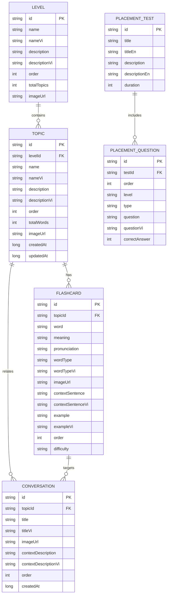

# Firebase Realtime Database Schema Documentation

## 📋 Tổng quan

File này mô tả chi tiết schema của Firebase Realtime Database cho ứng dụng học từ vựng tiếng Anh.

---

## 💾 Ứng dụng sử dụng các hình thức lưu trữ dữ liệu như thế nào?

Ứng dụng sử dụng **2 nhóm lưu trữ chính**:

### 1) Firebase Realtime Database (Cloud)

Mục đích: lưu **nội dung học tập dùng chung** (levels/topics/flashcards/conversations/placementTest/settings). Đây là dữ liệu “chuẩn” để mọi người dùng tải về và học.

- **Cách truy cập**: qua `FirebaseRepository` (Kotlin coroutine `await()`), kết nối tới URL RTDB của dự án.
- **Đặc điểm**:
  - Dữ liệu tổ chức theo cây JSON (NoSQL).
  - Ứng dụng chủ yếu **đọc (read)** dữ liệu nội dung.

### 2) Local Storage (SharedPreferences + Gson)

Mục đích: lưu **tiến độ học và lịch sử trên máy** để hiển thị nhanh, không phụ thuộc mạng và phục vụ AI gợi ý.

- `user_progress` (class `UserProgressManager`)
  - `study_history`: danh sách tối đa 100 phiên học (`StudyResult`).
  - `completed_topics`: map `{topicId -> TopicCompletionStatus}` (hoàn thành topic, bestAccuracy, totalTimeSpent, learnedFlashcardIds...).
- `dictionary_history` (class `SearchHistoryManager`)
  - `search_history`: lịch sử tra cứu từ điển (tối đa 50 từ) dùng cho “recent searches”.
- `placement_test_prefs` (class `PlacementTestManager`)
  - `test_completed`, `test_result`, `recommended_level`, `completed_date`: lưu kết quả bài test đầu vào.

Ghi chú: **tiến độ người dùng hiện tại lưu trên máy (local)**. Firebase RTDB hiện dùng để lưu dữ liệu nội dung học tập.

## 🗂️ Cấu trúc Database

```
firebase-database/
├── conversations/
│   └── {conversationId}/
├── levels/
│   └── {levelId}/
│       └── topics/
│           └── {topicId}/
│               └── flashcards: [ ... ]
├── placementTest/
│   └── (single object)
└── settings/
    └── app/
```

> Lưu ý: dữ liệu export hiện tại sử dụng **levels → topics → flashcards[]** (flashcards nhúng trong topic). Các node `/topics` và `/flashcards` dạng standalone có thể là schema cũ.

---

## 🧩 Sơ đồ quan hệ thực thể (ERD)

Firebase RTDB là NoSQL, nhưng có thể quy đổi thành các “thực thể/bảng” và quan hệ như sau:



Phần “UserProgress” trong app hiện tại lưu local (SharedPreferences), nên không được coi là “bảng cloud” trong ERD này.

---

## 📚 Topics Schema

**Path (thực tế)**: `/levels/{levelId}/topics/{topicId}`

Chứa thông tin về các chủ đề học tập.

### Fields:

| Field           | Type   | Required | Description                                         |
| --------------- | ------ | -------- | --------------------------------------------------- |
| `id`            | String | ✅       | Unique identifier (phải trùng với topicId)          |
| `name`          | String | ✅       | Tên chủ đề (tiếng Anh)                              |
| `nameVi`        | String | ✅       | Tên chủ đề (tiếng Việt)                             |
| `description`   | String | ✅       | Mô tả chủ đề (tiếng Anh)                            |
| `descriptionVi` | String | ✅       | Mô tả chủ đề (tiếng Việt)                           |
| `imageUrl`      | String | ✅       | URL hình ảnh đại diện (phải bắt đầu với http/https) |
| `order`         | Number | ✅       | Thứ tự hiển thị (>= 0)                              |
| `totalWords`    | Number | ✅       | Tổng số từ vựng trong chủ đề (>= 0)                 |
| `createdAt`     | Number | ✅       | Timestamp tạo (milliseconds)                        |
| `updatedAt`     | Number | ✅       | Timestamp cập nhật cuối (milliseconds)              |

### Example:

```json
{
  "topic_001": {
    "id": "topic_001",
    "name": "Daily Routine",
    "nameVi": "Hoạt động hàng ngày",
    "description": "Common words used in daily activities",
    "descriptionVi": "Từ vựng thường dùng trong các hoạt động hàng ngày",
    "imageUrl": "https://images.unsplash.com/photo-1495364141860-b0d03eccd065?w=800",
    "order": 1,
    "totalWords": 10,
    "createdAt": 1699488000000,
    "updatedAt": 1699488000000
  }
}
```

---

## 🎴 Flashcards Schema

**Path (thực tế)**: `/levels/{levelId}/topics/{topicId}/flashcards[]`

Chứa thông tin về từ vựng (flashcard).

### Fields:

| Field               | Type   | Required | Validation                                                    | Description                                       |
| ------------------- | ------ | -------- | ------------------------------------------------------------- | ------------------------------------------------- |
| `id`                | String | ✅       | Phải trùng với flashcardId                                    | Unique identifier                                 |
| `topicId`           | String | ✅       | Phải tồn tại trong /topics                                    | ID của chủ đề                                     |
| `word`              | String | ✅       | Length > 0                                                    | Từ vựng tiếng Anh                                 |
| `pronunciation`     | String | ✅       | -                                                             | Phiên âm IPA                                      |
| `meaning`           | String | ✅       | Length > 0                                                    | Nghĩa tiếng Việt                                  |
| `wordType`          | String | ✅       | Enum: noun, verb, adjective, adverb, preposition, conjunction | Loại từ (tiếng Anh)                               |
| `wordTypeVi`        | String | ✅       | -                                                             | Loại từ (tiếng Việt)                              |
| `imageUrl`          | String | ✅       | URL format                                                    | Hình ảnh minh họa                                 |
| `contextSentence`   | String | ✅       | -                                                             | Câu ví dụ có chứa từ (HTML: `<b><u>word</u></b>`) |
| `contextSentenceVi` | String | ✅       | -                                                             | Câu ví dụ tiếng Việt                              |
| `example`           | String | ✅       | -                                                             | Câu ví dụ bổ sung                                 |
| `exampleVi`         | String | ✅       | -                                                             | Câu ví dụ bổ sung tiếng Việt                      |
| `order`             | Number | ✅       | >= 0                                                          | Thứ tự trong chủ đề                               |
| `difficulty`        | String | ✅       | Enum: easy, medium, hard                                      | Độ khó                                            |
| `createdAt`         | Number | ✅       | -                                                             | Timestamp tạo                                     |

### Word Types:

- `noun` / `danh từ`
- `verb` / `động từ`
- `adjective` / `tính từ`
- `adverb` / `trạng từ`
- `preposition` / `giới từ`
- `conjunction` / `liên từ`

### Difficulty Levels:

- `easy`: Dễ
- `medium`: Trung bình
- `hard`: Khó

### Example:

```json
{
  "flashcard_001": {
    "id": "flashcard_001",
    "topicId": "topic_001",
    "word": "breakfast",
    "pronunciation": "/ˈbrek.fəst/",
    "meaning": "bữa sáng",
    "wordType": "noun",
    "wordTypeVi": "danh từ",
    "imageUrl": "https://images.unsplash.com/photo-1533089860892-a7c6f0a88666?w=800",
    "contextSentence": "I usually have <b><u>breakfast</u></b> at 7 AM every morning.",
    "contextSentenceVi": "Tôi thường ăn sáng lúc 7 giờ sáng mỗi ngày.",
    "example": "A healthy breakfast is important for starting your day.",
    "exampleVi": "Một bữa sáng lành mạnh rất quan trọng để bắt đầu ngày mới.",
    "order": 1,
    "difficulty": "easy",
    "createdAt": 1699488000000
  }
}
```

---

## 💬 Conversations Schema

**Path**: `/conversations/{conversationId}`

Chứa thông tin về các bài hội thoại học từ vựng.

### Fields:

| Field                  | Type   | Required | Validation                    | Description                                          |
| ---------------------- | ------ | -------- | ----------------------------- | ---------------------------------------------------- |
| `id`                   | String | ✅       | Phải trùng với conversationId | Unique identifier                                    |
| `title`                | String | ✅       | Length > 0                    | Tiêu đề (tiếng Anh)                                  |
| `titleVi`              | String | ✅       | Length > 0                    | Tiêu đề (tiếng Việt)                                 |
| `imageUrl`             | String | ✅       | URL format                    | Hình ảnh minh họa                                    |
| `contextDescription`   | String | ✅       | -                             | Mô tả ngữ cảnh (tiếng Anh)                           |
| `contextDescriptionVi` | String | ✅       | -                             | Mô tả ngữ cảnh (tiếng Việt)                          |
| `dialogue`             | Array  | ✅       | -                             | Danh sách câu thoại (có thể kèm câu hỏi trắc nghiệm) |
| `vocabularyWords`      | Array  | ✅       | -                             | Danh sách từ vựng xuất hiện trong hội thoại          |
| `order`                | Number | ✅       | >= 0                          | Thứ tự                                               |
| `createdAt`            | Number | ❌       | -                             | Timestamp tạo (nếu có)                               |

### Dialogue Schema:

| Field            | Type   | Required | Description                             |
| ---------------- | ------ | -------- | --------------------------------------- |
| `speaker`        | String | ✅       | Tên người nói                           |
| `text`           | String | ✅       | Nội dung (tiếng Anh)                    |
| `textVi`         | String | ✅       | Nội dung (tiếng Việt)                   |
| `order`          | Number | ✅       | Thứ tự câu                              |
| `vocabularyWord` | String | ❌       | Từ vựng trọng tâm của dòng này (nếu có) |
| `question`       | String | ❌       | Câu hỏi trắc nghiệm (EN)                |
| `questionVi`     | String | ❌       | Câu hỏi trắc nghiệm (VI)                |
| `options`        | Array  | ❌       | Danh sách lựa chọn (QuizOption)         |

### VocabularyWord Schema:

| Field           | Type   | Required | Description      |
| --------------- | ------ | -------- | ---------------- |
| `word`          | String | ✅       | Từ vựng          |
| `meaning`       | String | ✅       | Nghĩa tiếng Việt |
| `pronunciation` | String | ✅       | Phiên âm         |
| `wordType`      | String | ✅       | Loại từ (EN)     |
| `wordTypeVi`    | String | ✅       | Loại từ (VI)     |

### QuizOption Schema:

| Field       | Type    | Required | Description         |
| ----------- | ------- | -------- | ------------------- |
| `id`        | String  | ✅       | ID lựa chọn         |
| `text`      | String  | ✅       | Nội dung đáp án     |
| `isCorrect` | Boolean | ✅       | Đáp án đúng hay sai |

### Example:

```json
{
  "conversation_001": {
    "id": "conversation_001",
    "title": "Morning Routine 1",
    "titleVi": "Thói quen buổi sáng 1",
    "imageUrl": "https://images.pexels.com/photos/296301/pexels-photo-296301.jpeg?w=800",
    "contextDescription": "Talking about daily morning activities",
    "contextDescriptionVi": "Nói về các hoạt động buổi sáng hàng ngày",
    "order": 1,
    "createdAt": 1699488000000,
    "dialogue": [
      {
        "order": 0,
        "speaker": "Person A",
        "text": "Hello! Let's talk about morning routine.",
        "textVi": "Xin chào! Hãy nói về thói quen buổi sáng.",
        "vocabularyWord": "hello",
        "question": "What does 'hello' mean?",
        "questionVi": "'hello' có nghĩa là gì?",
        "options": [
          { "id": "a", "text": "xin chào", "isCorrect": true },
          { "id": "b", "text": "tạm biệt", "isCorrect": false }
        ]
      },
      {
        "order": 1,
        "speaker": "Person B",
        "text": "Sure! I'd love to discuss this topic.",
        "textVi": "Chắc chắn rồi! Tôi rất muốn thảo luận chủ đề này.",
        "vocabularyWord": "discuss",
        "question": "What does 'discuss' mean?",
        "questionVi": "'discuss' có nghĩa là gì?",
        "options": [
          { "id": "a", "text": "thảo luận", "isCorrect": true },
          { "id": "b", "text": "từ chối", "isCorrect": false }
        ]
      }
    ],
    "vocabularyWords": [
      {
        "word": "hello",
        "meaning": "xin chào",
        "pronunciation": "/həˈloʊ/",
        "wordType": "interjection",
        "wordTypeVi": "thán từ"
      },
      {
        "word": "discuss",
        "meaning": "thảo luận",
        "pronunciation": "/dɪˈskʌs/",
        "wordType": "verb",
        "wordTypeVi": "động từ"
      }
    ]
  }
}
```

---

## 👤 User Progress (Local - trên máy)

Ứng dụng **không lưu user progress lên Firebase RTDB** ở phiên bản hiện tại. Thay vào đó, tiến độ học được lưu bằng SharedPreferences để:

- đọc/ghi nhanh (không cần mạng),
- cập nhật UI tức thời,
- làm dữ liệu đầu vào cho AI gợi ý.

### Local Keys (SharedPreferences)

- `user_progress` (UserProgressManager)
  - `study_history`: List<StudyResult> (tối đa 100)
  - `completed_topics`: Map<String, TopicCompletionStatus>

> Nếu sau này cần đồng bộ cloud, có thể bổ sung node `/userProgress/{userId}` như một schema mở rộng.

### Cấu trúc dữ liệu local (tương đương “bảng”)

#### StudyResult (lưu trong `study_history`)

| Field           | Type   | Description                     |
| --------------- | ------ | ------------------------------- |
| `topicId`       | String | ID topic                        |
| `topicName`     | String | Tên topic (để hiển thị nhanh)   |
| `studyType`     | String | `flashcard` hoặc `conversation` |
| `totalItems`    | Int    | Số lượng item trong phiên học   |
| `correctCount`  | Int    | Số câu đúng                     |
| `timeSpent`     | Long   | Thời gian học (ms)              |
| `accuracy`      | Float  | % đúng                          |
| `completedDate` | Long   | Timestamp (ms)                  |

#### TopicCompletionStatus (lưu trong `completed_topics`)

| Field                         | Type        | Description                                  |
| ----------------------------- | ----------- | -------------------------------------------- |
| `topicId`                     | String      | ID topic                                     |
| `isCompleted`                 | Boolean     | Đã hoàn thành topic hay chưa                 |
| `lastStudyDate`               | Long        | Lần học gần nhất                             |
| `totalFlashcardsLearned`      | Int         | Tổng flashcards learned (dùng thống kê)      |
| `totalConversationsCompleted` | Int         | Tổng conversations completed (dùng thống kê) |
| `bestAccuracy`                | Float       | Accuracy tốt nhất                            |
| `totalTimeSpent`              | Long        | Tổng thời gian học                           |
| `learnedFlashcardIds`         | Set<String> | Tập flashcard đã học (phục vụ % progress UI) |

---

## 🧪 Placement Test Schema

**Path**: `/placementTest`

Chứa bài test đầu vào (1 object) gồm metadata + danh sách câu hỏi.

### Fields chính:

| Field           | Type          | Required | Description            |
| --------------- | ------------- | -------- | ---------------------- |
| `id`            | String        | ✅       | ID bài test            |
| `title`         | String        | ✅       | Tiêu đề (VI)           |
| `titleEn`       | String        | ✅       | Tiêu đề (EN)           |
| `description`   | String        | ✅       | Mô tả (VI)             |
| `descriptionEn` | String        | ✅       | Mô tả (EN)             |
| `duration`      | Number        | ✅       | Thời gian (giây)       |
| `instructions`  | Array<String> | ✅       | Hướng dẫn              |
| `passingScores` | Object        | ✅       | Ngưỡng điểm theo level |
| `questions`     | Array<Object> | ✅       | Danh sách câu hỏi      |

### Question fields:

| Field           | Type          | Required | Description                               |
| --------------- | ------------- | -------- | ----------------------------------------- |
| `id`            | String        | ✅       | ID câu hỏi                                |
| `order`         | Number        | ✅       | Thứ tự                                    |
| `level`         | String        | ✅       | beginner/elementary/intermediate/advanced |
| `type`          | String        | ✅       | vocabulary/grammar/reading                |
| `question`      | String        | ✅       | Câu hỏi (EN)                              |
| `questionVi`    | String        | ✅       | Câu hỏi (VI)                              |
| `options`       | Array<String> | ✅       | 4 lựa chọn                                |
| `correctAnswer` | Number        | ✅       | Index đáp án đúng (0-3)                   |
| `explanation`   | String        | ❌       | Giải thích (EN)                           |
| `explanationVi` | String        | ❌       | Giải thích (VI)                           |

> Lưu ý UI: bài kiểm tra đầu vào không hiển thị đáp án/giải thích trong lúc làm bài; `explanation*` có thể giữ lại trong data để mở rộng (ví dụ chế độ luyện tập).

---

## ⚙️ Settings Schema

**Path**: `/settings/app`

Cài đặt ứng dụng.

### Fields:

| Field                 | Type    | Required | Validation    | Description         |
| --------------------- | ------- | -------- | ------------- | ------------------- |
| `version`             | String  | ✅       | Format: x.x.x | Phiên bản hiện tại  |
| `minSupportedVersion` | String  | ✅       | Format: x.x.x | Phiên bản tối thiểu |
| `maintenanceMode`     | Boolean | ✅       | -             | Chế độ bảo trì      |
| `dailyGoal`           | Number  | ✅       | >= 1          | Mục tiêu hàng ngày  |
| `reminderEnabled`     | Boolean | ✅       | -             | Bật nhắc nhở        |
| `reminderTime`        | String  | ✅       | Format: HH:mm | Giờ nhắc nhở        |
| `soundEnabled`        | Boolean | ✅       | -             | Bật âm thanh        |
| `autoPlayAudio`       | Boolean | ✅       | -             | Tự động phát âm     |

---

## 🔒 Firebase Security Rules

File `firebase-rules.json` định nghĩa các quy tắc bảo mật:

- **Topics/Flashcards/Conversations**: Đọc công khai, chỉ admin mới được ghi
- **Settings**: Đọc công khai, chỉ admin mới được ghi

### Validation Rules:

- URL phải bắt đầu với `http://` hoặc `https://`
- Email phải đúng format
- Version phải theo format `x.y.z`
- Reminder time theo format `HH:mm`
- Foreign keys phải tồn tại (topicId, flashcardId, etc.)

---

## 🔑 Firebase Paths Constants

Sử dụng class `FirebasePaths` trong Kotlin để truy cập:

```kotlin
// Lấy tất cả topics
val topicsRef = database.getReference(FirebasePaths.TOPICS)

// Lấy một topic cụ thể
val topicRef = database.getReference(FirebasePaths.topic("topic_001"))

// Lấy user progress
// Query flashcards theo topic
val flashcardsRef = database.getReference(FirebasePaths.FLASHCARDS)
    .orderByChild("topicId")
    .equalTo("topic_001")
```

---

## 📝 Data Models

Tất cả data models được định nghĩa trong file:
`app/src/main/java/com/uilover/project247/data/models/FirebaseModels.kt`

Các models chính:

- `Topic`
- `Flashcard`
- `Conversation` (với `DialogueLine` và `QuizOption`)
- `AppSettings`

---

## 🚀 Cách import dữ liệu lên Firebase

1. Vào Firebase Console
2. Chọn Realtime Database
3. Click vào menu (⋮) → Import JSON
4. Chọn file `firebase-data.json`
5. Click Import

---

## 📊 Naming Conventions

- **IDs**: `{entity}_{số thứ tự}` (vd: `topic_001`, `flashcard_001`)
- **Timestamps**: Milliseconds (long)
- **URLs**: Phải có scheme (http/https)
- **Fields**: camelCase
- **Boolean**: `is` prefix không bắt buộc
