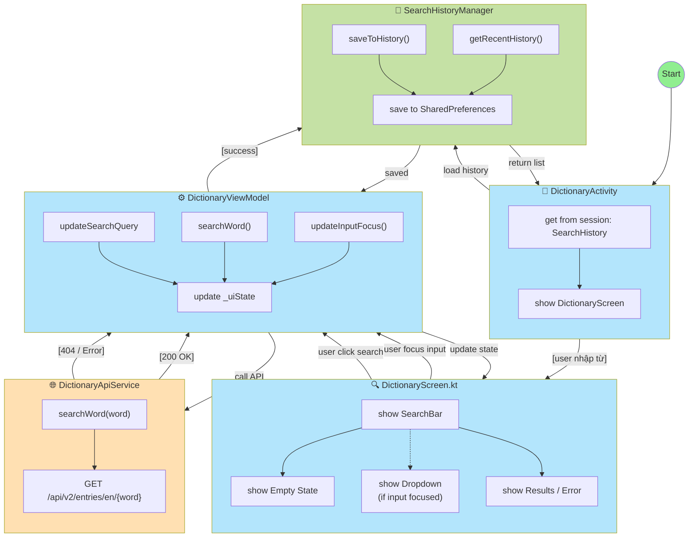

# Tài liệu chức năng: Tra từ điển (Dictionary Lookup)

## 📋 Mục lục

- [a) Mô tả chi tiết chức năng](#a-mô-tả-chi-tiết-chức-năng)
- [b) Thiết kế giao diện](#b-thiết-kế-giao-diện)
- [c) Giải pháp kỹ thuật](#c-giải-pháp-kỹ-thuật)
- [d) Phát triển tương lai](#d-phát-triển-tương-lai)

---

## 0) Tổng quan

Chức năng tra từ điển sử dụng **Free Dictionary API** để tra cứu từ vựng tiếng Anh trong thời gian thực. Hệ thống tự động lưu lịch sử tra cứu và hỗ trợ dropdown gợi ý từ lịch sử khi người dùng gõ.

- **Nguồn dữ liệu**: Free Dictionary API (https://dictionaryapi.dev/)
- **Lưu lịch sử**: SharedPreferences (cục bộ, tối đa 50 từ)
- **Tính năng nổi bật**:
  - Autocomplete từ lịch sử tra cứu
  - Hiển thị đầy đủ phiên âm, nghĩa, ví dụ, synonyms/antonyms
  - Audio phát âm (nếu API cung cấp)
  - Lọc lịch sử thông minh theo từ khóa

---

## a) Mô tả chi tiết chức năng

### 📊 Sơ đồ hoạt động (Component Diagram)



### 🔄 Luồng thực hiện chi tiết

#### Bước 1: Khởi tạo màn hình

1. User click vào tab "Tra từ" trong Bottom Navigation
2. `DictionaryActivity` được khởi động
3. `DictionaryViewModel` được tạo qua `ViewModelFactory`
4. `loadSearchHistory()` được gọi tự động trong `init {}`
5. `SearchHistoryManager.getRecentHistory(10)` đọc từ SharedPreferences
6. UI hiển thị `DictionaryScreen` với SearchBar và Empty State

#### Bước 2: Tương tác với SearchBar

**Case 2a: User focus vào input**

1. `onFocusChanged` callback trigger
2. `viewModel.updateInputFocus(true)` được gọi
3. `_uiState.update { it.copy(isInputFocused = true) }`
4. UI recompose → hiển thị `SearchHistoryDropdown`

**Case 2b: User gõ từ khóa**

1. `onValueChange` callback với text mới
2. `viewModel.updateSearchQuery(text)` cập nhật state
3. `filteredRecentSearches` (computed property) tự động lọc:
   ```kotlin
   recentSearches.filter {
       it.word.contains(searchQuery, ignoreCase = true)
   }
   ```
4. Dropdown cập nhật real-time với kết quả lọc

**Case 2c: User chọn từ lịch sử**

1. Click vào item trong dropdown
2. `viewModel.selectRecentSearch(word)` được gọi
3. Auto-fill searchQuery + gọi `searchWord()`
4. `updateInputFocus(false)` → ẩn dropdown

#### Bước 3: Tìm kiếm từ

1. User nhấn Search icon hoặc ImeAction.Search trên bàn phím
2. `viewModel.searchWord(searchQuery)` được gọi
3. Validation: nếu `word.isBlank()` → set errorMessage → return
4. `_uiState.update { it.copy(isLoading = true, isInputFocused = false) }`
5. Coroutine launch trong `viewModelScope`:
   ```kotlin
   try {
       val response = apiService.searchWord(word.trim().lowercase())
       if (response.isSuccessful && response.body() != null) {
           // Parse thành công
       } else {
           // HTTP 404 hoặc empty body
       }
   } catch (e: Exception) {
       // Network error
   }
   ```

#### Bước 4: Xử lý kết quả API

**Case 4a: Success (HTTP 200)**

1. Parse `List<DictionaryEntry>` từ response.body()
2. Lấy entry đầu tiên để tạo `SearchHistoryItem`:
   ```kotlin
   val historyItem = SearchHistoryItem(
       word = entry.word,
       phonetic = entry.phonetic ?: entry.phonetics.firstOrNull()?.text ?: "",
       meaning = firstMeaning?.definitions?.firstOrNull()?.definition ?: "",
       partOfSpeech = firstMeaning?.partOfSpeech ?: ""
   )
   ```
3. `historyManager.saveToHistory(historyItem)`:
   - Load history hiện tại từ SharedPreferences
   - Remove từ cũ nếu tồn tại (case-insensitive)
   - Thêm item mới vào đầu list
   - Trim xuống 50 item nếu vượt quá
   - Serialize thành JSON và lưu
4. `loadSearchHistory()` → reload UI
5. Update state: `entries = response.body()`, `isLoading = false`

**Case 4b: Not Found (HTTP 404)**

1. Update state: `errorMessage = "Không tìm thấy từ 'xxx'. Vui lòng kiểm tra lại."`
2. UI hiển thị `ErrorSection` (card đỏ nhạt)

**Case 4c: Network Error**

1. Catch exception trong try-catch
2. Update state: `errorMessage = "Lỗi kết nối: ${e.message}"`

#### Bước 5: Hiển thị kết quả

1. UI observe `uiState.entries` qua `collectAsState()`
2. `DictionaryResultsSection` render `LazyColumn`
3. Mỗi entry render thành `DictionaryEntryCard`:
   - Header: word + phonetic + audio button
   - Meanings: loop qua meanings[], mỗi meaning có:
     - partOfSpeech (noun, verb, etc.)
     - Definitions list (numbered)
     - Synonyms/Antonyms (chip-style)
   - Origin (nếu có)

### 📋 Ràng buộc nghiệp vụ

#### R1: Input Validation

- **Ràng buộc**: Từ tra cứu không được rỗng hoặc chỉ có khoảng trắng
- **Kiểm tra**: `if (word.isBlank())` trong `searchWord()`
- **Xử lý**: Hiển thị error message "Vui lòng nhập từ cần tra"

#### R2: Lịch sử tra cứu

- **Ràng buộc 2a**: Chỉ lưu từ tra cứu thành công (HTTP 200)
  - **Lý do**: Tránh lưu typo hoặc từ không tồn tại
- **Ràng buộc 2b**: Từ trùng lặp được đưa lên đầu với timestamp mới
  - **Implementation**: `history.removeAll { it.word.equals(item.word, ignoreCase = true) }`
- **Ràng buộc 2c**: Giới hạn 50 từ
  - **Lý do**: Tránh SharedPreferences quá lớn, giảm performance
  - **Xử lý**: `history.subList(MAX_HISTORY_SIZE, history.size).clear()`

#### R3: Dropdown autocomplete

- **Ràng buộc 3a**: Chỉ hiển thị khi input có focus
  - **Logic**: `if (uiState.isInputFocused && uiState.filteredRecentSearches.isNotEmpty())`
- **Ràng buộc 3b**: Lọc real-time (case-insensitive)
  - **Computed**: `filteredRecentSearches` trong `DictionaryUiState`
- **Ràng buộc 3c**: Ẩn dropdown khi chọn item
  - **Logic**: `selectRecentSearch()` set `isInputFocused = false`

#### R4: Audio playback

- **Ràng buộc**: Nút phát âm chỉ hiển thị khi API có audio URL hợp lệ
- **Kiểm tra**:
  ```kotlin
  val audioUrl = entry.phonetics.firstOrNull {
      it.audio.isNullOrEmpty().not()
  }?.audio
  if (audioUrl != null) { /* show button */ }
  ```

#### R5: Error handling

- **HTTP 404**: "Không tìm thấy từ 'xxx'. Vui lòng kiểm tra lại."
- **Network error**: "Lỗi kết nối: [exception message]"
- **Timeout**: Retrofit default timeout (10s read, 10s connect)

---

## b) Thiết kế giao diện

### 🎨 Màn hình chính (DictionaryScreen)

```
┌─────────────────────────────────────┐
│  ← Tra từ điển                      │  ← TopAppBar
├─────────────────────────────────────┤
│  ┌───────────────────────────────┐  │
│  │ 🔍 Nhập từ cần tra...      ✕ │  │  ← SearchBar (Floating)
│  └───────────────────────────────┘  │
│  ┌───────────────────────────────┐  │
│  │ 🔍 hello                      │  │  ← Dropdown
│  │    /həˈloʊ/          noun     │  │    (khi focus)
│  │    A greeting...              │  │
│  ├───────────────────────────────┤  │
│  │ 🔍 world                      │  │
│  │    /wɜːld/           noun     │  │
│  └───────────────────────────────┘  │
│                                     │
│  ┌───────────────────────────────┐  │
│  │ hello              🔊         │  │  ← Result Card
│  │ /həˈloʊ/                      │  │
│  ├───────────────────────────────┤  │
│  │ noun                          │  │
│  │ 1. A greeting (salutation)    │  │
│  │    said when meeting...       │  │
│  │    📝 She said hello as...    │  │
│  │                               │  │
│  │ Synonyms: greeting, hi        │  │
│  ├───────────────────────────────┤  │
│  │ 📚 Origin                     │  │
│  │ From Old English...           │  │
│  └───────────────────────────────┘  │
└─────────────────────────────────────┘
```

### 📐 Thiết kế chi tiết các component

#### 1️⃣ TopAppBar (CenterAlignedTopAppBar)

```kotlin
CenterAlignedTopAppBar(
    title = { Text("Tra từ điển") },
    navigationIcon = { IconButton { Icon(ArrowBack) } },
    colors = TopAppBarDefaults.centerAlignedTopAppBarColors(
        containerColor = MaterialTheme.colorScheme.surface
    )
)
```

- **Height**: 64dp (default)
- **Background**: Surface color (white)
- **Title**: center-aligned, titleLarge typography
- **Navigation icon**: ArrowBack, 24dp size

#### 2️⃣ SearchBar (OutlinedTextField)

```kotlin
OutlinedTextField(
    modifier = Modifier
        .fillMaxWidth()
        .padding(16.dp)
        .onFocusChanged { viewModel.updateInputFocus(it.isFocused) },
    shape = RoundedCornerShape(12.dp),
    colors = OutlinedTextFieldDefaults.colors(
        focusedContainerColor = Color.White,
        unfocusedContainerColor = Color.White
    )
)
```

- **Position**: Floating trên content (Box overlay)
- **Padding**: 16dp (all sides)
- **Border radius**: 12dp
- **Height**: 56dp (single line)
- **Leading icon**: Search icon (24dp, default color)
- **Trailing icon**: Close icon (khi có text)
- **Placeholder**: "Nhập từ cần tra..." (gray)
- **Keyboard**: ImeAction.Search

#### 3️⃣ Dropdown lịch sử (SearchHistoryDropdown)

```kotlin
Card(
    modifier = Modifier
        .fillMaxWidth()
        .padding(horizontal = 16.dp, top = 4.dp)
        .shadow(8.dp, RoundedCornerShape(12.dp)),
    shape = RoundedCornerShape(12.dp),
    colors = CardDefaults.cardColors(containerColor = Color.White)
)
```

**Layout mỗi item:**

```
┌──────────────────────────────────┐
│ 🔍 hello                   noun  │  ← Row
│    /həˈloʊ/                      │  ← phonetic (italic, gray)
│    A greeting (salutation)...   │  ← meaning (truncated)
├──────────────────────────────────┤  ← HorizontalDivider
│ 🔍 world                   noun  │
└──────────────────────────────────┘
```

- **Max height**: 300dp (scrollable nếu nhiều item)
- **Shadow**: 8dp elevation
- **Item padding**: 12dp vertical, 16dp horizontal
- **Divider**: E0E0E0 color, 1dp thickness
- **Icon**: Search icon, purple (0xFF6200EA), 20dp
- **Word**: bodyLarge, bold, 0xFF212121
- **PartOfSpeech**: bodySmall, italic, right-aligned, 0xFF757575
- **Phonetic**: bodySmall, italic, 0xFF757575
- **Meaning**: bodySmall, 0xFF616161, maxLines=1, ellipsis

#### 4️⃣ Empty State

```
     🔍  ← Search icon (64dp, gray)
Nhập từ để bắt đầu tra cứu
```

- **Position**: Center of screen
- **Icon**: Search, 64dp, Color.Gray
- **Text**: bodyLarge, Color.Gray

#### 5️⃣ Loading State

- **Component**: CircularProgressIndicator
- **Position**: Center of screen
- **Size**: Default (48dp)

#### 6️⃣ Error State (ErrorSection)

```kotlin
Card(
    colors = CardDefaults.cardColors(
        containerColor = Color(0xFFFFEBEE)  // Light red
    )
)
```

- **Layout**: Row với icon Close ở bên phải
- **Text color**: 0xFFC62828 (dark red)
- **Padding**: 16dp
- **Border radius**: Default (12dp)

#### 7️⃣ Result Card (DictionaryEntryCard)

**Structure:**

```
┌─────────────────────────────────┐
│ hello              🔊 Play      │  ← Header Row
│ /həˈloʊ/                        │
├─────────────────────────────────┤  ← Divider
│ noun                            │  ← Meaning section
│ ━━━                             │
│ 1. A greeting (salutation)...   │  ← Definition
│    📝 "She said hello..."       │  ← Example (quote)
│                                 │
│ ▶ Synonyms: greeting, hi        │  ← Synonyms (chips)
│ ◀ Antonyms: goodbye, bye        │
├─────────────────────────────────┤
│ verb                            │  ← Next meaning
│ ...                             │
├─────────────────────────────────┤
│ 📚 Origin                       │  ← Origin (if exists)
│ From Old English hǽl...         │
└─────────────────────────────────┘
```

**Specs chi tiết:**

**Header:**

- word: headlineMedium (28sp), bold, primary color (0xFF6200EA)
- phonetic: bodyLarge (16sp), italic, gray
- Audio button: FilledTonalIconButton, 48dp size, PlayArrow icon 24dp

**Meaning section:**

- partOfSpeech: titleMedium (16sp), bold, secondary color
- Definition number: Ordered list (1., 2., ...)
- definition: bodyMedium (14sp), black
- example: bodyMedium, italic, gray, trong quote block (background 0xFFF5F5F5)

**Synonyms/Antonyms:**

- Layout: FlowRow với các chip
- Icon: Arrow right/left, 16dp
- Text: bodySmall, primary color
- Background: primaryContainer (light purple)
- Padding: 8dp horizontal, 4dp vertical
- Border radius: 8dp

**Origin:**

- Background: 0xFFF5F5F5 (light gray card)
- Padding: 12dp
- Border radius: 8dp
- Title: titleSmall, bold, 0xFF666666
- Content: bodyMedium, 0xFF333333

### 🎨 Color Palette

```kotlin
val PrimaryPurple = Color(0xFF6200EA)      // Main accent
val SecondaryBlue = Color(0xFF03DAC6)      // Secondary accent
val Background = Color(0xFFF5F5F5)         // Screen background
val Surface = Color.White                   // Card/AppBar background
val ErrorRed = Color(0xFFC62828)           // Error text
val ErrorBackground = Color(0xFFFFEBEE)     // Error card
val TextPrimary = Color(0xFF212121)        // Main text
val TextSecondary = Color(0xFF757575)      // Secondary text
val TextTertiary = Color(0xFF616161)       // Tertiary text
val Divider = Color(0xFFE0E0E0)            // Dividers
val GrayLight = Color(0xFFF5F5F5)          // Light gray backgrounds
```

### 📱 Responsive Design

- **Padding**: 16dp standard (màn hình nhỏ), có thể scale lên 24dp cho tablet
- **LazyColumn contentPadding**:
  - top: 80dp (để tránh SearchBar overlay)
  - horizontal: 16dp
  - bottom: 16dp
- **Card elevation**: 2dp (subtle)
- **Shadow**: 8dp cho dropdown (prominent)

---

## c) Giải pháp kỹ thuật

### 🏗️ Kiến trúc tổng thể (MVVM Pattern)

```
┌──────────────────────────────────────────────┐
│                UI Layer                       │
│  ┌─────────────────────────────────────┐    │
│  │ DictionaryActivity (ComponentActivity) │  │
│  │  - ViewModelFactory                  │    │
│  │  - Scaffold + Compose UI             │    │
│  └──────────────┬──────────────────────┘    │
│                 │                             │
│  ┌──────────────▼──────────────────────┐    │
│  │ DictionaryScreen (Composable)       │    │
│  │  - SearchBarSection                 │    │
│  │  - SearchHistoryDropdown            │    │
│  │  - DictionaryResultsSection         │    │
│  └──────────────┬──────────────────────┘    │
└─────────────────┼────────────────────────────┘
                  │ collectAsState()
┌─────────────────▼────────────────────────────┐
│              ViewModel Layer                  │
│  ┌─────────────────────────────────────┐    │
│  │ DictionaryViewModel (AndroidViewModel) │  │
│  │  - StateFlow<DictionaryUiState>     │    │
│  │  - updateSearchQuery()              │    │
│  │  - searchWord()                     │    │
│  │  - updateInputFocus()               │    │
│  └──────────────┬──────────────────────┘    │
└─────────────────┼────────────────────────────┘
                  │ Repository calls
┌─────────────────▼────────────────────────────┐
│               Data Layer                      │
│  ┌──────────────────┐  ┌──────────────────┐ │
│  │ DictionaryApiService│ SearchHistoryManager│
│  │  - Retrofit        │  - SharedPreferences│
│  │  - Gson            │  - Gson serialization│
│  └──────────────────┘  └──────────────────┘ │
│         │                       │             │
│  ┌──────▼──────┐       ┌───────▼──────┐    │
│  │ Free Dict API│      │ Local Storage │    │
│  └─────────────┘       └──────────────┘    │
└──────────────────────────────────────────────┘
```

### 📦 Mô tả giải pháp chi tiết

#### 1️⃣ Data Layer - DictionaryApiService

**Công nghệ**: Retrofit 2.9.0 + Gson Converter

```kotlin
interface DictionaryApiService {
    @GET("api/v2/entries/en/{word}")
    suspend fun searchWord(@Path("word") word: String): Response<List<DictionaryEntry>>

    companion object {
        private const val BASE_URL = "https://api.dictionaryapi.dev/"

        fun create(): DictionaryApiService {
            return Retrofit.Builder()
                .baseUrl(BASE_URL)
                .addConverterFactory(GsonConverterFactory.create())
                .build()
                .create(DictionaryApiService::class.java)
        }
    }
}
```

**Vai trò**:

- Giao tiếp với Free Dictionary API qua HTTP REST
- Parse JSON response thành Kotlin data classes
- Xử lý network layer (timeout, retry không có - dùng default Retrofit)

**Data flow**:

```
ViewModel.searchWord()
  → apiService.searchWord(word) [suspend function]
  → Retrofit execute HTTP GET
  → Gson parse JSON → List<DictionaryEntry>
  → Return Response<List<DictionaryEntry>>
```

#### 2️⃣ Data Layer - SearchHistoryManager

**Công nghệ**: SharedPreferences + Gson

```kotlin
class SearchHistoryManager(context: Context) {
    private val prefs = context.getSharedPreferences(
        "dictionary_history",
        Context.MODE_PRIVATE
    )
    private val gson = Gson()

    fun saveToHistory(item: SearchHistoryItem) {
        val history = getHistory().toMutableList()
        history.removeAll { it.word.equals(item.word, ignoreCase = true) }
        history.add(0, item)  // Thêm vào đầu
        if (history.size > 50) {
            history.subList(50, history.size).clear()
        }
        val json = gson.toJson(history)
        prefs.edit().putString("search_history", json).apply()
    }

    fun getHistory(): List<SearchHistoryItem> {
        val json = prefs.getString("search_history", null) ?: return emptyList()
        return try {
            val type = object : TypeToken<List<SearchHistoryItem>>() {}.type
            gson.fromJson(json, type) ?: emptyList()
        } catch (e: Exception) {
            emptyList()
        }
    }
}
```

**Vai trò**:

- Lưu trữ persistent lịch sử tra cứu
- Serialize/Deserialize với Gson
- Quản lý giới hạn 50 item

**Data model**:

```kotlin
data class SearchHistoryItem(
    val word: String,
    val phonetic: String,
    val meaning: String,
    val partOfSpeech: String,
    val timestamp: Long = System.currentTimeMillis()
)
```

#### 3️⃣ ViewModel Layer - DictionaryViewModel

**Công nghệ**: AndroidViewModel + Kotlin Coroutines + StateFlow

```kotlin
class DictionaryViewModel(context: Context) : AndroidViewModel(application) {
    private val apiService = DictionaryApiService.create()
    private val historyManager = SearchHistoryManager(context)

    private val _uiState = MutableStateFlow(DictionaryUiState())
    val uiState: StateFlow<DictionaryUiState> = _uiState.asStateFlow()

    init {
        loadSearchHistory()
    }

    fun searchWord(word: String) {
        viewModelScope.launch {
            _uiState.update { it.copy(isLoading = true) }
            try {
                val response = apiService.searchWord(word.trim().lowercase())
                if (response.isSuccessful && response.body() != null) {
                    val entries = response.body()!!
                    // Lưu vào history
                    val historyItem = createHistoryItem(entries.first())
                    historyManager.saveToHistory(historyItem)
                    loadSearchHistory()

                    _uiState.update {
                        it.copy(entries = entries, isLoading = false)
                    }
                } else {
                    _uiState.update {
                        it.copy(
                            errorMessage = "Không tìm thấy từ '$word'",
                            isLoading = false
                        )
                    }
                }
            } catch (e: Exception) {
                _uiState.update {
                    it.copy(
                        errorMessage = "Lỗi kết nối: ${e.message}",
                        isLoading = false
                    )
                }
            }
        }
    }
}
```

**UI State**:

```kotlin
data class DictionaryUiState(
    val isLoading: Boolean = false,
    val searchQuery: String = "",
    val entries: List<DictionaryEntry> = emptyList(),
    val errorMessage: String? = null,
    val recentSearches: List<SearchHistoryItem> = emptyList(),
    val isInputFocused: Boolean = false
) {
    // Computed property - lọc lịch sử theo searchQuery
    val filteredRecentSearches: List<SearchHistoryItem>
        get() = if (searchQuery.isBlank()) {
            recentSearches
        } else {
            recentSearches.filter {
                it.word.contains(searchQuery, ignoreCase = true)
            }
        }
}
```

**Vai trò**:

- Quản lý UI state với StateFlow (reactive)
- Xử lý business logic (search, filter, error handling)
- Tách biệt UI và data layer (single source of truth)

#### 4️⃣ UI Layer - Jetpack Compose

**DictionaryScreen structure**:

```kotlin
@Composable
fun DictionaryScreen(viewModel: DictionaryViewModel) {
    val uiState by viewModel.uiState.collectAsState()

    Scaffold(topBar = { TopAppBar() }) { padding ->
        Box(modifier = Modifier.padding(padding)) {
            // Content layer
            when {
                uiState.isLoading -> LoadingState()
                uiState.errorMessage != null -> ErrorState()
                uiState.entries.isNotEmpty() -> ResultsState()
                else -> EmptyState()
            }

            // Overlay layer (SearchBar + Dropdown)
            Column {
                SearchBarSection()
                if (uiState.isInputFocused) {
                    SearchHistoryDropdown()
                }
            }
        }
    }
}
```

**Recomposition optimization**:

- Dùng `collectAsState()` để observe StateFlow
- Khi `_uiState` thay đổi → UI tự động recompose
- Chỉ recompose các Composable bị ảnh hưởng (granular updates)

### 🆕 Vấn đề mới / Điểm đổi mới

#### 1️⃣ Smart Autocomplete từ Lịch sử

**Điểm mới**:

- Computed property trong data class để filter real-time
- Không cần thêm state riêng cho filtered list
- Update UI tự động khi `searchQuery` thay đổi

**So sánh với cách cũ**:

```kotlin
// ❌ Cách cũ: Manual filtering trong ViewModel
fun filterHistory(query: String) {
    val filtered = recentSearches.filter { ... }
    _filteredSearches.value = filtered  // Extra state
}

// ✅ Cách mới: Computed property
val filteredRecentSearches: List<SearchHistoryItem>
    get() = recentSearches.filter { ... }
```

**Ưu điểm**:

- Ít state hơn → ít bug hơn
- Luôn sync với searchQuery (không thể out-of-sync)
- Code ngắn gọn hơn

#### 2️⃣ Rich History Items

**Điểm mới**:

- Lưu không chỉ `word` mà còn `phonetic`, `meaning`, `partOfSpeech`
- Dropdown preview đầy đủ thông tin → UX tốt hơn

**So sánh**:

```kotlin
// ❌ Cách cũ: Chỉ lưu word
data class HistoryItem(val word: String)

// ✅ Cách mới: Lưu full context
data class SearchHistoryItem(
    val word: String,
    val phonetic: String,
    val meaning: String,
    val partOfSpeech: String,
    val timestamp: Long
)
```

**Lợi ích**:

- User nhớ ngữ cảnh khi xem lịch sử
- Không cần gọi lại API khi click lịch sử
- Preview meaning giúp phân biệt các từ đồng âm

#### 3️⃣ Zero-Library Dropdown UI

**Điểm mới**:

- Implement dropdown thuần Compose (không dùng thư viện)
- Dùng Box overlay + zIndex để control layer order
- Custom styling với Material3 components

**Implementation**:

```kotlin
Box {
    // Content layer
    LazyColumn(contentPadding = PaddingValues(top = 80.dp)) { ... }

    // Overlay layer
    Column {
        SearchBar()
        if (showDropdown) {
            Card(modifier = Modifier.shadow(8.dp)) { ... }
        }
    }
}
```

**Ưu điểm**:

- Không dependency ngoài → app size nhỏ hơn
- Full control styling và behavior
- Dễ customize theo design system

#### 4️⃣ Declarative UI với State Pattern

**Điểm mới**:

- Single state object (`DictionaryUiState`) chứa toàn bộ UI state
- UI render dựa trên state, không có imperative updates

**So sánh**:

```kotlin
// ❌ Cách cũ (XML + imperative):
fun showLoading() {
    progressBar.visibility = View.VISIBLE
    recyclerView.visibility = View.GONE
}
fun showResults(data: List) {
    progressBar.visibility = View.GONE
    recyclerView.visibility = View.VISIBLE
    adapter.submitList(data)
}

// ✅ Cách mới (Compose + declarative):
when {
    uiState.isLoading -> LoadingState()
    uiState.entries.isNotEmpty() -> ResultsState(uiState.entries)
}
```

**Lợi ích**:

- UI luôn consistent với state
- Dễ test (chỉ cần assert state)
- Ít bug về UI inconsistency

### ⚠️ Vấn đề khó / Thách thức kỹ thuật

#### 1️⃣ Quản lý Focus State cho Dropdown

**Vấn đề**:

- OutlinedTextField mất focus khi user click vào dropdown item
- Nếu không xử lý → dropdown biến mất trước khi `onItemClick` trigger
- Race condition giữa focus loss và click event

**Nguyên nhân**:

```
User click dropdown item
  → TextField detect touch outside
  → onFocusChanged(false) trigger
  → Dropdown hidden (recompose)
  → Click event lost (composable đã bị remove)
```

**Giải pháp**:

```kotlin
// 1. Track focus state riêng trong ViewModel
fun updateInputFocus(isFocused: Boolean) {
    _uiState.update { it.copy(isInputFocused = isFocused) }
}

// 2. Dropdown sử dụng state này (không trực tiếp từ TextField focus)
if (uiState.isInputFocused && uiState.filteredRecentSearches.isNotEmpty()) {
    SearchHistoryDropdown()
}

// 3. Khi select item → manual set focus = false
fun selectRecentSearch(word: String) {
    updateSearchQuery(word)
    updateInputFocus(false)  // Ẩn dropdown trước khi search
    searchWord(word)
}
```

**Lesson learned**:

- Không nên rely trực tiếp vào Composable internal state
- Quản lý UI state trong ViewModel để có full control

#### 2️⃣ Z-Index Overlay của SearchBar + Dropdown

**Vấn đề**:

- SearchBar và Dropdown cần nằm trên content (floating)
- LazyColumn content có thể scroll lên đè lên dropdown
- Cần đảm bảo dropdown luôn "trên cùng"

**Thử nghiệm thất bại**:

```kotlin
// ❌ Approach 1: zIndex trong Column → không work
Column {
    LazyColumn(modifier = Modifier.zIndex(0f)) { ... }
    SearchBar(modifier = Modifier.zIndex(1f))  // Vẫn bị đè
}

// ❌ Approach 2: SearchBar trong LazyColumn sticky header
// → Dropdown bị crop bởi LazyColumn bounds
```

**Giải pháp thành công**:

```kotlin
Box {
    // Content với padding top để tránh SearchBar
    LazyColumn(
        contentPadding = PaddingValues(
            top = 80.dp,  // Height của SearchBar + margin
            start = 16.dp,
            end = 16.dp,
            bottom = 16.dp
        )
    ) { ... }

    // Overlay layer - tự động nằm trên content
    Column(modifier = Modifier.padding(16.dp)) {
        SearchBar()
        if (showDropdown) {
            Dropdown()  // Vẽ sau cùng → z-index cao nhất
        }
    }
}
```

**Key insight**:

- Box children được vẽ theo thứ tự → child cuối nằm trên cùng
- Dùng contentPadding thay vì margin để content không bị overlap

#### 3️⃣ Parse API Response Không Đồng Nhất

**Vấn đề**:

- Free Dictionary API có 2 cách trả phonetic:

  ```json
  // Case 1: Top-level phonetic
  { "word": "hello", "phonetic": "/həˈloʊ/", ... }

  // Case 2: Chỉ trong phonetics array
  {
    "word": "world",
    "phonetic": null,
    "phonetics": [
      { "text": "/wɜːld/", "audio": "..." }
    ]
  }
  ```

**Giải pháp**:

```kotlin
// Fallback chain
val phoneticText = entry.phonetic
    ?: entry.phonetics.firstOrNull()?.text
    ?: ""

// Hiển thị trong UI
if (phoneticText != null && phoneticText.isNotEmpty()) {
    Text(phoneticText)
}
```

**Tương tự với Audio URL**:

```kotlin
val audioUrl = entry.phonetics.firstOrNull {
    it.audio.isNullOrEmpty().not()
}?.audio

if (audioUrl != null) {
    AudioButton(url = audioUrl)
}
```

**Lesson learned**:

- Luôn có fallback khi parse API bên thứ 3
- API documentation không phải lúc nào cũng chính xác
- Test với nhiều từ khác nhau để phát hiện edge cases

#### 4️⃣ Network Error Handling

**Vấn đề**:

- Retrofit throw nhiều loại exception khác nhau
- Cần map sang user-friendly message
- Phân biệt HTTP error vs network error

**Exception types**:

```kotlin
try {
    apiService.searchWord(word)
} catch (e: Exception) {
    when (e) {
        is HttpException -> {
            // HTTP 4xx, 5xx errors
            when (e.code()) {
                404 -> "Không tìm thấy từ '$word'"
                500 -> "Lỗi server, vui lòng thử lại"
                else -> "Lỗi HTTP ${e.code()}"
            }
        }
        is IOException -> {
            // Network errors (no connection, timeout)
            "Lỗi kết nối: Kiểm tra internet của bạn"
        }
        else -> {
            // Unexpected errors
            "Lỗi không xác định: ${e.message}"
        }
    }
}
```

**Giải pháp hiện tại (simplified)**:

```kotlin
catch (e: Exception) {
    _uiState.update {
        it.copy(errorMessage = "Lỗi kết nối: ${e.message}")
    }
}
```

**Cải tiến trong tương lai**:

- Thêm retry logic với exponential backoff
- Offline cache với Room Database
- Network connectivity check trước khi gọi API

#### 5️⃣ SharedPreferences JSON Parsing Error

**Vấn đề**:

- Data class thay đổi → JSON cũ không parse được
- App crash khi migrate schema

**Scenario**:

```kotlin
// Version 1: Simple model
data class HistoryItem(val word: String)

// Version 2: Rich model
data class SearchHistoryItem(
    val word: String,
    val phonetic: String,  // ← Field mới
    val meaning: String    // ← Field mới
)

// JSON cũ: {"word":"hello"}
// Parse vào SearchHistoryItem → crash (missing required fields)
```

**Giải pháp**:

```kotlin
fun getHistory(): List<SearchHistoryItem> {
    val json = prefs.getString("search_history", null) ?: return emptyList()

    return try {
        val type = object : TypeToken<List<SearchHistoryItem>>() {}.type
        gson.fromJson(json, type) ?: emptyList()
    } catch (e: Exception) {
        // Fallback: xóa cache cũ và return empty
        Log.e("SearchHistory", "Failed to parse history, clearing cache", e)
        prefs.edit().remove("search_history").apply()
        emptyList()
    }
}
```

**Best practice cho tương lai**:

```kotlin
// Dùng nullable fields + default values
data class SearchHistoryItem(
    val word: String,
    val phonetic: String = "",      // ← Default value
    val meaning: String = "",       // ← Default value
    val partOfSpeech: String = "",
    val timestamp: Long = System.currentTimeMillis()
)
```

**Hoặc dùng migration strategy**:

```kotlin
// Lưu schema version
private const val PREFS_VERSION = 2

fun migrate() {
    val currentVersion = prefs.getInt("schema_version", 1)
    if (currentVersion < PREFS_VERSION) {
        // Clear old data
        prefs.edit().clear().apply()
        prefs.edit().putInt("schema_version", PREFS_VERSION).apply()
    }
}
```

---

## d) Phát triển tương lai

### 🎵 1. Audio Playback - Phát âm thanh

**Mô tả**:

- Tích hợp MediaPlayer hoặc ExoPlayer để play audio URL từ API
- UI: FilledTonalIconButton với PlayArrow icon → pause icon khi đang play

**Implementation**:

```kotlin
class AudioPlayer(context: Context) {
    private val mediaPlayer = MediaPlayer()

    fun play(url: String) {
        mediaPlayer.apply {
            reset()
            setDataSource(url)
            prepareAsync()
            setOnPreparedListener { start() }
        }
    }

    fun pause() {
        if (mediaPlayer.isPlaying) {
            mediaPlayer.pause()
        }
    }
}

// Trong ViewModel
private val audioPlayer = AudioPlayer(context)
fun playAudio(url: String) {
    audioPlayer.play(url)
}
```

**UI Update**:

```kotlin
AudioButton(
    audioUrl = audioUrl,
    isPlaying = uiState.isAudioPlaying,
    onClick = { viewModel.toggleAudio(audioUrl) }
)
```

**Challenges**:

- Quản lý lifecycle (pause khi user leave app)
- Handle network error khi load audio
- Show loading indicator khi buffering

### 🗣️ 2. Text-to-Speech (TTS) Fallback

**Mô tả**:

- Khi API không có audio URL → dùng Android TTS engine
- Hỗ trợ offline pronunciation

**Implementation**:

```kotlin
class TTSManager(context: Context) {
    private val tts = TextToSpeech(context) { status ->
        if (status == TextToSpeech.SUCCESS) {
            tts.language = Locale.US
        }
    }

    fun speak(word: String) {
        tts.speak(word, TextToSpeech.QUEUE_FLUSH, null, null)
    }
}
```

**Logic**:

```kotlin
if (audioUrl != null) {
    audioPlayer.play(audioUrl)
} else {
    ttsManager.speak(word)
}
```

### 💾 3. Offline Mode - Cache với Room Database

**Mô tả**:

- Cache kết quả tra cứu vào local database
- Tra từ offline khi không có mạng

**Schema**:

```kotlin
@Entity(tableName = "dictionary_cache")
data class DictionaryCacheEntity(
    @PrimaryKey val word: String,
    val phonetic: String,
    val meanings: String,  // JSON serialized
    val timestamp: Long,
    val expiryDate: Long   // Cache TTL: 30 days
)

@Dao
interface DictionaryDao {
    @Query("SELECT * FROM dictionary_cache WHERE word = :word")
    suspend fun getCachedWord(word: String): DictionaryCacheEntity?

    @Insert(onConflict = OnConflictStrategy.REPLACE)
    suspend fun cacheWord(entity: DictionaryCacheEntity)
}
```

**Logic**:

```kotlin
suspend fun searchWord(word: String) {
    // 1. Check cache first
    val cached = dictionaryDao.getCachedWord(word)
    if (cached != null && !cached.isExpired()) {
        return cached.toDictionaryEntry()
    }

    // 2. Fetch from API
    try {
        val response = apiService.searchWord(word)
        // Save to cache
        dictionaryDao.cacheWord(response.toCacheEntity())
        return response
    } catch (e: IOException) {
        // 3. Fallback to cache if network error
        if (cached != null) {
            return cached.toDictionaryEntry()
        }
        throw e
    }
}
```

### ⭐ 4. Favorites - Lưu từ yêu thích

**Mô tả**:

- User có thể bookmark từ vựng quan trọng
- Tab riêng để xem danh sách favorites

**Schema**:

```kotlin
@Entity(tableName = "favorites")
data class FavoriteWord(
    @PrimaryKey val word: String,
    val phonetic: String,
    val meaning: String,
    val addedAt: Long
)
```

**UI Changes**:

```kotlin
// Thêm star icon vào DictionaryEntryCard
IconToggleButton(
    checked = uiState.isFavorite,
    onCheckedChange = { viewModel.toggleFavorite(word) }
) {
    Icon(
        imageVector = if (checked) Icons.Filled.Star else Icons.Outlined.StarBorder,
        tint = if (checked) Color(0xFFFFD700) else Color.Gray
    )
}
```

### 📚 5. Flashcard Integration

**Mô tả**:

- Nút "Thêm vào flashcard" trong result card
- Tự động tạo flashcard từ kết quả tra từ
- Sync với Firebase flashcards để học từ

**Implementation**:

```kotlin
fun addToFlashcard(entry: DictionaryEntry) {
    val flashcard = Flashcard(
        word = entry.word,
        phonetic = entry.phonetic ?: "",
        contextSentence = entry.meanings.first().definitions.first().example ?: "",
        meaning = entry.meanings.first().definitions.first().definition,
        type = entry.meanings.first().partOfSpeech
    )

    firebaseRepository.saveFlashcard(flashcard, topicId = "custom")
}
```

**UI**:

```kotlin
Button(
    onClick = { viewModel.addToFlashcard(entry) },
    colors = ButtonDefaults.buttonColors(containerColor = Green)
) {
    Icon(Icons.Default.Add)
    Text("Thêm vào flashcard")
}
```

### 🌐 6. Vietnamese Translation

**Mô tả**:

- Tích hợp Google Translate API
- Hiển thị nghĩa tiếng Việt song song với tiếng Anh

**API**:

```kotlin
interface TranslateApiService {
    @POST("language/translate/v2")
    suspend fun translate(
        @Body request: TranslateRequest
    ): TranslateResponse
}

data class TranslateRequest(
    val q: String,          // Text to translate
    val target: String,     // "vi"
    val source: String,     // "en"
    val key: String         // API key
)
```

**UI Update**:

```kotlin
Column {
    Text("Definition: ${definition.definition}")
    if (uiState.vietnameseTranslation != null) {
        Text(
            "Nghĩa: ${uiState.vietnameseTranslation}",
            color = Color.Blue,
            fontStyle = FontStyle.Italic
        )
    }
}
```

### 📅 7. Word of the Day

**Mô tả**:

- Hiển thị từ vựng phổ biến mỗi ngày
- Notification để nhắc nhở user học từ

**Implementation**:

```kotlin
// Lưu vào Firebase hoặc local DB
data class WordOfTheDay(
    val date: String,       // "2025-12-12"
    val word: String,
    val definition: String,
    val example: String
)

// WorkManager để schedule notification
class DailyWordWorker : Worker() {
    override fun doWork(): Result {
        val word = getRandomWord()
        showNotification(word)
        return Result.success()
    }
}
```

### 🔮 8. Search Suggestions - Gợi ý từ khi gõ

**Mô tả**:

- Gọi autocomplete API khi user gõ
- Hiển thị danh sách từ gợi ý (không phải lịch sử)

**API**: Datamuse API

```kotlin
interface DatamuseApiService {
    @GET("sug")
    suspend fun getSuggestions(
        @Query("s") query: String
    ): List<Suggestion>
}

data class Suggestion(
    val word: String,
    val score: Int
)
```

**UI**:

```kotlin
// Dropdown mix giữa suggestions và history
Column {
    if (uiState.suggestions.isNotEmpty()) {
        Text("Gợi ý", style = labelSmall)
        uiState.suggestions.forEach { SuggestionItem(it) }
        Divider()
    }

    if (uiState.recentSearches.isNotEmpty()) {
        Text("Lịch sử", style = labelSmall)
        uiState.recentSearches.forEach { HistoryItem(it) }
    }
}
```

---

## 📁 Phụ lục: Files liên quan

### Source code structure

```
app/src/main/java/com/uilover/project247/
├── DictionaryActivity/
│   ├── DictionaryActivity.kt
│   ├── Model/
│   │   └── DictionaryViewModel.kt
│   └── screens/
│       └── DictionaryScreen.kt
├── data/
│   ├── api/
│   │   └── DictionaryApiService.kt
│   ├── models/
│   │   └── DictionaryModels.kt
│   └── repository/
│       └── SearchHistoryManager.kt
└── ui/
    └── theme/
        └── Theme.kt
```

### Dependencies

```kotlin
// Retrofit for API calls
implementation("com.squareup.retrofit2:retrofit:2.9.0")
implementation("com.squareup.retrofit2:converter-gson:2.9.0")

// Compose UI
implementation(libs.androidx.compose.material3)
implementation(libs.androidx.activity.compose)
implementation(libs.androidx.lifecycle.viewmodel.compose)

// Coroutines
implementation(libs.kotlinx.coroutines.android)
```

### Permissions

```xml
<uses-permission android:name="android.permission.INTERNET" />
<uses-permission android:name="android.permission.ACCESS_NETWORK_STATE" />
```

---

## 📊 Metrics & Analytics (Future)

- **Search count**: Số lần tra từ / ngày
- **Popular words**: Top từ được tra nhiều nhất
- **History size**: Average số từ trong lịch sử
- **Cache hit rate**: Tỷ lệ hit cache vs API call
- **Error rate**: Tỷ lệ lỗi network / 404

---

**Document version**: 1.0  
**Last updated**: December 12, 2025  
**Author**: Development Team
