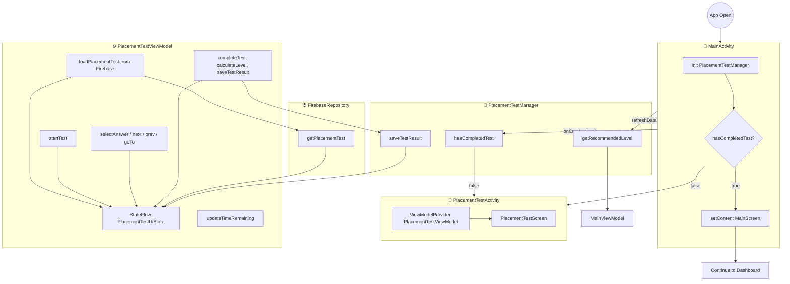

# Tài liệu chức năng: Bài test đầu vào & Phân level (Placement Test)

## 📋 Mục lục

- [0) Tổng quan](#0-tổng-quan)
- [a) Mô tả chi tiết chức năng](#a-mô-tả-chi-tiết-chức-năng)
- [b) Thiết kế giao diện](#b-thiết-kế-giao-diện)
- [c) Giải pháp kỹ thuật](#c-giải-pháp-kỹ-thuật)
- [d) Phát triển tương lai](#d-phát-triển-tương-lai)
- [📁 Phụ lục: Files liên quan](#-phụ-lục-files-liên-quan)

---

## 0) Tổng quan

Chức năng bài test đầu vào giúp xác định trình độ tiếng Anh ban đầu của người dùng và tự động đề xuất cấp độ học phù hợp (Beginner, Elementary, Intermediate, Advanced). Bài test gồm nhiều câu hỏi trắc nghiệm, có thời lượng quy định. Sau khi hoàn thành, hệ thống lưu kết quả cục bộ và điều hướng Dashboard hiển thị đúng level đề xuất.

- Nguồn dữ liệu: Firebase Realtime Database (`placementTest` node)
- Lưu kết quả: SharedPreferences qua `PlacementTestManager`
- Tác động UI: `MainViewModel` đọc recommended level để chọn `Level` mặc định khi hiển thị `MainScreen`

---

## a) Mô tả chi tiết chức năng

### 📊 Sơ đồ hoạt động (Activity/Component Diagram)

### 🔄 Luồng thực hiện chi tiết

1. Khởi tạo ứng dụng: `MainActivity` tạo `PlacementTestManager` và kiểm tra `hasCompletedTest()`. Nếu chưa, mở `PlacementTestActivity`.
2. `PlacementTestActivity` hiển thị `PlacementTestScreen`, ViewModel tự `loadPlacementTest()` từ Firebase.
3. Màn hướng dẫn (Instructions) hiển thị tiêu đề, mô tả, thời gian, tổng số câu và checklist hướng dẫn. Người dùng chọn "Bắt đầu làm bài" hoặc "Bỏ qua".
4. Trong quá trình làm bài:
   - Dùng thanh tiến trình và thanh số câu (LazyRow) để điều hướng nhanh.
   - Chọn đáp án cập nhật `userAnswers` và `isAnswered`.
   - Nút "Tiếp/Hoàn thành" chỉ mở khi đã chọn đáp án (`enabled = isAnswered`).
   - Có thể quay lại/trước (`previousQuestion()`/`nextQuestion()`/`goToQuestion(index)`).
5. Hoàn thành test: `completeTest()` tính số câu đúng, điểm %, xác định level qua `calculateLevel()`, tạo `PlacementTestResult`, lưu bằng `saveTestResult()`.
6. Khi quay lại Dashboard: `MainViewModel` đọc `getRecommendedLevel()` để chọn level phù hợp (map sang tên level trong Firebase) và tải topics của level đó.

### 📋 Ràng buộc nghiệp vụ

- R1: Mỗi câu hỏi chỉ được tính một lựa chọn (single choice).
- R2: Không thể chuyển sang câu kế tiếp nếu chưa chọn đáp án (`isAnswered = true`).
- R3: Kết quả bài test chỉ lưu khi người dùng đi hết luồng "Hoàn thành" hoặc khi thời gian về 0.
- R4: Level đề xuất dựa trên ngưỡng `passingScores` của bài test trong Firebase (config động theo nội dung test).
- R5: Nếu người dùng chọn "Bỏ qua", coi như chưa có khuyến nghị level, Dashboard mặc định vào "Beginner".

---

## b) Thiết kế giao diện

### 🎨 Màn hình hướng dẫn (InstructionsScreen)

- Header emoji lớn + Title (`headlineMedium`, bold)
- Description (`bodyLarge`, gray)
- Card "Hướng dẫn" với bullet points
- InfoRow: Tổng số câu, Thời gian (phút)
- Primary Button: "Bắt đầu làm bài" (màu PrimaryPurple)
- TextButton: "Bỏ qua (Học từ cơ bản)"

### 🧩 Màn hình làm bài (TestContentScreen)

- TopAppBar: Tiêu đề + `LinearProgressIndicator` theo `viewModel.getProgress()`
- Navigator: `LazyRow` 40dp, vòng tròn hiển thị số câu; trạng thái: current (purple), answered (gray)
- Card Câu hỏi: `questionVi` + `question` (EN) nếu khác nhau
- Options: `OptionCard` với các state màu (selected, correct/incorrect khi cần)
- Actions:
  - `OutlinedButton` Trước (khi index > 0)
  - `Button` Tiếp/Hoàn thành (enabled khi `isAnswered`)

### 🏁 Màn hình kết quả (TestResultScreen)

- Emoji chúc mừng + Title "Hoàn thành!"
- Card kết quả:
  - Vòng tròn điểm lớn (score %)
  - Bảng thống kê: tổng câu, đúng, sai
  - Chip/Box level đề xuất (text Việt: "Cơ bản/Sơ cấp/Trung cấp/Nâng cao")
- Primary Button: "Bắt đầu học" → Đóng `PlacementTestActivity`

### 🎨 Màu sắc & spacing

- Theo Design System: PrimaryPurple, LightPurple, Background
- `SmallPadding`/`MediumPadding`/`LargePadding`, `CardRadius = 12.dp`

---

## c) Giải pháp kỹ thuật

### 🏗️ Kiến trúc tổng thể (MVVM)

- View: `PlacementTestScreen.kt` (Compose) quan sát `StateFlow<PlacementTestUiState>`
- ViewModel: `PlacementTestViewModel.kt` quản lý state, xử lý tương tác, tính điểm, lưu kết quả
- Data: `FirebaseRepository.getPlacementTest()` tải cấu hình test từ Firebase
- Manager: `PlacementTestManager` chịu trách nhiệm lưu/đọc kết quả và level đề xuất (SharedPreferences)
- Dashboard: `MainViewModel` dùng `getRecommendedLevel()` để chọn level mặc định

### 📦 Mô tả dữ liệu Firebase

- Node: `placementTest`
- Model: `PlacementTest` gồm:
  - `title`, `description`, `duration`, `totalQuestions`
  - `passingScores`: `{ beginner, elementary, intermediate, advanced }`
  - `questions[]`: `PlacementQuestion { id, order, level, type, question, questionVi, options[], correctAnswer }`

### 🔧 Luồng tính toán & lưu kết quả

- Tính `correctCount` qua đối chiếu `userAnswers[index] == question.correctAnswer`
- `scorePercentage = (correctCount * 100) / totalQuestions`
- Map `passingScores` → gọi `PlacementTestManager.calculateLevel()` trả về cặp `(levelId, levelVi)`
- Tạo `PlacementTestResult` và `PlacementTestManager.saveTestResult(result)`
- `MainActivity` check `hasCompletedTest()` để quyết định mở `PlacementTestActivity`
- `MainViewModel.loadLevels()` map `recommendedLevelId` → tên Level trong Firebase để chọn mặc định

### 🆕 Điểm mới / giá trị

- Đồng bộ khuyến nghị level vào Dashboard tự động; không cần user tự chọn.
- Cho phép cấu hình ngưỡng đậu từng level hoàn toàn từ dữ liệu Firebase (không hard-code).
- Điều hướng câu hỏi bằng `LazyRow` + state answer giúp UX nhanh và trực quan.

### ⚠️ Vấn đề khó / thách thức kỹ thuật

- Mapping levelId (beginner/elementary/...) sang tên level thực tế trong Firebase ("Beginner", "Elementary", ...); cần đảm bảo đồng bộ dữ liệu.
- Quản lý thời gian đếm ngược: hiện ViewModel có `updateTimeRemaining(seconds)`; cần Timer chuẩn và auto `completeTest()` khi về 0.
- Trường hợp người dùng thoát giữa chừng: quyết định lưu tạm (draft) hay bắt buộc hoàn thành; hiện tại thiết kế chỉ lưu khi hoàn thành.
- Tính bảo toàn dữ liệu khi schema Firebase thay đổi: cần default values trong data classes để tránh crash khi parse.

---

## d) Phát triển tương lai

1. Đồng hồ đếm ngược thực tế (CountDownTimer trong ViewModel) + hiển thị ở TopAppBar
2. Làm lại (reset) bài test: nút "Làm lại" trong phần Cài đặt → `PlacementTestManager.resetTest()`
3. Gợi ý lộ trình học (Learning Path) theo điểm chi tiết: nếu sai nhiều ở level X → ưu tiên topic level đó.
4. Phân tích câu hỏi theo kỹ năng (Reading/Listening/Vocabulary) để đề xuất chế độ ôn tập phù hợp.
5. Lưu kết quả lên Firebase (per-user) để đồng bộ đa thiết bị và thống kê.
6. A/B test ngưỡng `passingScores` để tối ưu tỷ lệ đề xuất level chính xác.
7. Hỗ trợ nhiều bộ đề (A/B/C) với chọn ngẫu nhiên, chống học vẹt.

---

## 📁 Phụ lục: Files liên quan

- Activity: `app/src/main/java/com/uilover/project247/PlacementTestActivity/PlacementTestActivity.kt`
- ViewModel: `app/src/main/java/com/uilover/project247/PlacementTestActivity/Model/PlacementTestViewModel.kt`
- Screen: `app/src/main/java/com/uilover/project247/PlacementTestActivity/screens/PlacementTestScreen.kt`
- Models: `app/src/main/java/com/uilover/project247/data/models/PlacementTest.kt`
- Repository: `app/src/main/java/com/uilover/project247/data/repository/FirebaseRepository.kt` (`getPlacementTest()`)
- Manager: `app/src/main/java/com/uilover/project247/data/repository/PlacementTestManager.kt`
- Dashboard logic: `app/src/main/java/com/uilover/project247/DashboardActivity/Model/MainViewModel.kt` (map level)

---

Document version: 1.0  
Last updated: December 12, 2025  
Author: Development Team
