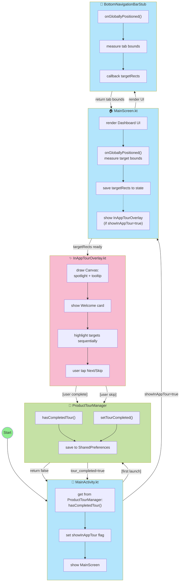

# Tài liệu chức năng: Product Tour (Hướng dẫn lần đầu sử dụng)

## 📋 Mục lục

- [a) Mô tả chi tiết chức năng](#a-mô-tả-chi-tiết-chức-năng)
- [b) Thiết kế giao diện](#b-thiết-kế-giao-diện)
- [c) Giải pháp kỹ thuật](#c-giải-pháp-kỹ-thuật)
- [d) Phát triển tương lai](#d-phát-triển-tương-lai)

---

## 0) Tổng quan

Product Tour là tính năng hướng dẫn người dùng **lần đầu tiên mở ứng dụng** bằng kỹ thuật **spotlight overlay**. Màn hình sẽ bị làm tối và "khoét lỗ" (spotlight) tại đúng vị trí các UI element quan trọng, kèm theo tooltip mô tả chức năng.

- **Kỹ thuật**: Canvas drawing với Path và FillType.EvenOdd
- **Lưu trạng thái**: SharedPreferences (cục bộ)
- **Tính năng nổi bật**:
  - Spotlight động theo vị trí UI thực tế (auto-tracking với onGloballyPositioned)
  - Tooltip tự động định vị (trên/dưới target)
  - Có thể bỏ qua (Skip) bất cứ lúc nào
  - Chỉ hiển thị 1 lần duy nhất

---

## a) Mô tả chi tiết chức năng

### 📊 Sơ đồ hoạt động (Component Diagram)



### 🔄 Luồng thực hiện chi tiết

> **Tổng quan luồng**: Product Tour được kích hoạt ngay khi user mở app lần đầu tiên. Hệ thống sẽ kiểm tra trạng thái từ SharedPreferences, nếu chưa xem tour thì hiển thị overlay spotlight với tooltip hướng dẫn từng UI element theo thứ tự. User có thể xem từng bước hoặc bỏ qua bất cứ lúc nào.

#### Phase 1: Khởi tạo và kiểm tra

**📝 Mô tả**: Khi MainActivity khởi động, ứng dụng cần kiểm tra xem user đã hoàn thành tour chưa. Nếu chưa, sẽ hiển thị tour overlay. Phase này đảm bảo tour chỉ xuất hiện 1 lần duy nhất cho mỗi user.

**Step 1: MainActivity onCreate**

```kotlin
class MainActivity : ComponentActivity() {
    override fun onCreate(savedInstanceState: Bundle?) {
        super.onCreate(savedInstanceState)

        // 1. Khởi tạo ProductTourManager
        val tourManager = ProductTourManager(this)

        // 2. Kiểm tra đã xem tour chưa
        val hasCompleted = tourManager.hasCompletedTour()

        setContent {
            MainScreen(
                showInAppTour = !hasCompleted,  // 3. Truyền flag
                onTourComplete = { tourManager.setTourCompleted() }
            )
        }
    }
}
```

**Step 2: ProductTourManager check**

```kotlin
fun hasCompletedTour(): Boolean {
    return prefs.getBoolean("tour_completed", false)
}
```

**Decision logic**:

- `tour_completed == false` → `showInAppTour = true` → hiển thị tour
- `tour_completed == true` → `showInAppTour = false` → vào app bình thường

**🎯 Kết quả Phase 1**:

- Nếu user lần đầu mở app → `showInAppTour = true` → Chuyển sang Phase 2
- Nếu user đã xem tour → `showInAppTour = false` → MainScreen render bình thường, không có overlay

---

#### Phase 2: Layout Measurement & Target Tracking

**📝 Mô tả**: Sau khi xác định cần hiển thị tour, ứng dụng bắt đầu đo vị trí (bounds) của các UI element cần hướng dẫn. Sử dụng `onGloballyPositioned()` để lấy tọa độ chính xác của từng target. Các bounds này sẽ được lưu vào state và truyền cho overlay để vẽ spotlight đúng vị trí.

**Step 3: MainScreen measure UI elements**

```kotlin
@Composable
fun MainScreen(showInAppTour: Boolean) {
    var levelSelectorRect by remember { mutableStateOf<Rect?>(null) }
    var topicItemRect by remember { mutableStateOf<Rect?>(null) }
    val bottomNavTargets = remember { mutableStateMapOf<String, Rect>() }

    Column {
        // Level Selector
        LevelSelector(
            modifier = Modifier.onGloballyPositioned { coords ->
                levelSelectorRect = coords.boundsInRoot()
            }
        )

        // Topic LazyColumn
        LazyColumn {
            items(topics) { topic ->
                TopicCard(
                    modifier = Modifier.onGloballyPositioned { coords ->
                        if (topicItemRect == null) {  // Chỉ lưu item đầu tiên
                            topicItemRect = coords.boundsInRoot()
                        }
                    }
                )
            }
        }

        // Bottom Navigation
        BottomNavigationBarStub(
            onTabBoundsChanged = { tabId, rect ->
                bottomNavTargets[tabId] = rect
            }
        )
    }

    // Show tour overlay
    if (showInAppTour) {
        InAppTourOverlay(
            targetRects = mapOf(
                "level_selector" to levelSelectorRect,
                "topic_item" to topicItemRect,
                "tab_search" to bottomNavTargets["tab_search"],
                "tab_board" to bottomNavTargets["tab_board"],
                "tab_chat" to bottomNavTargets["tab_chat"],
                "tab_statistics" to bottomNavTargets["tab_statistics"]
            ),
            onComplete = onTourComplete
        )
    }
}
```

**Kỹ thuật chính: onGloballyPositioned**

```kotlin
Modifier.onGloballyPositioned { layoutCoordinates ->
    val rect = layoutCoordinates.boundsInRoot()
    // rect.left, rect.top, rect.right, rect.bottom
    // Tọa độ tương đối với root (màn hình)
}
```

**🔍 Chi tiết hoạt động**:

1. **Level Selector**: Khi component render xong, `onGloballyPositioned` được gọi, lưu bounds vào `levelSelectorRect`
2. **Topic Item đầu tiên**: Guard condition `if (topicItemRect == null)` đảm bảo chỉ lưu item đầu tiên trong LazyColumn
3. **Bottom Navigation Tabs**: Mỗi tab (Tra từ, Học, Hội thoại, Thống kê) đo bounds riêng và lưu vào Map với key là tab ID
4. **State Update**: Mỗi lần bounds được đo, state update → trigger recomposition
5. **Conditional Render**: Khi `showInAppTour = true` và có đủ targetRects, InAppTourOverlay được hiển thị

**🎯 Kết quả Phase 2**: Map chứa tọa độ của tất cả targets được truyền xuống InAppTourOverlay để vẽ spotlight

---

#### Phase 3: Render Spotlight Tour

**📝 Mô tả**: Overlay bắt đầu hiển thị với màn tối và spotlight. Đây là phase chính của tour, nơi user nhìn thấy UI được highlight và đọc tooltip hướng dẫn. Overlay quản lý danh sách các steps và hiển thị từng bước một.

**Step 4: InAppTourOverlay setup**

```kotlin
@Composable
fun InAppTourOverlay(
    targetRects: Map<String, Rect?>,
    onComplete: () -> Unit
) {
    var currentStep by remember { mutableStateOf(0) }

    val steps = listOf(
        TourStep("welcome", null, "👋", "Chào mừng!", "Hãy cùng..."),
        TourStep("level_selector", targetRects["level_selector"], "🎯", "Chọn cấp độ", "..."),
        TourStep("topic_item", targetRects["topic_item"], "📚", "Chủ đề học", "..."),
        TourStep("tab_search", targetRects["tab_search"], "🔍", "Tra từ", "..."),
        TourStep("tab_board", targetRects["tab_board"], "📖", "Học từ vựng", "..."),
        TourStep("tab_chat", targetRects["tab_chat"], "💬", "Hội thoại", "..."),
        TourStep("tab_statistics", targetRects["tab_statistics"], "📊", "Thống kê", "...")
    )

    Box(modifier = Modifier.fillMaxSize()) {
        // Spotlight canvas
        Canvas(modifier = Modifier.fillMaxSize()) {
            drawSpotlight(steps[currentStep].targetRect)
        }

        // Tooltip
        TooltipCard(
            step = steps[currentStep],
            progress = currentStep + 1,
            total = steps.size,
            onNext = {
                if (currentStep < steps.size - 1) {
                    currentStep++
                } else {
                    onComplete()
                }
            },
            onSkip = { onComplete() }
        )
    }
}
```

**🔍 Chi tiết hoạt động**:

1. **Khởi tạo steps**: Tạo list 7 TourStep (Welcome + 6 targets) với thông tin emoji, title, description
2. **State management**: `currentStep` bắt đầu từ 0, mỗi lần user nhấn "Tiếp theo" sẽ tăng lên 1
3. **Conditional rendering**: Step hiện tại quyết định targetRect nào được highlight và tooltip nào hiển thị
4. **Canvas overlay**: Vẽ lớp tối toàn màn hình với hole spotlight tại vị trí target
5. **Tooltip card**: Hiển thị thông tin hướng dẫn kèm progress bar và nút điều hướng

**Step 5: Canvas drawing spotlight**

```kotlin
fun DrawScope.drawSpotlight(targetRect: Rect?) {
    val path = Path().apply {
        // 1. Full screen rect (tối toàn màn)
        addRect(Rect(0f, 0f, size.width, size.height))

        if (targetRect != null) {
            // 2. Rounded rect tại target (khoét lỗ)
            val expandedRect = targetRect.inflate(8.dp.toPx())
            addRoundRect(
                RoundRect(
                    expandedRect,
                    cornerRadius = CornerRadius(12.dp.toPx())
                )
            )
        }

        // 3. EvenOdd fill: vẽ full rect - rounded rect
        fillType = PathFillType.EvenOdd
    }

    drawPath(
        path = path,
        color = Color.Black.copy(alpha = 0.75f)
    )
}
```

**Giải thích kỹ thuật**:

- `PathFillType.EvenOdd`: Quy tắc tô màu "chẵn-lẻ"
  - Điểm nằm trong số lẻ shape → tô màu
  - Điểm nằm trong số chẵn shape → không tô
- Full rect (1 shape) - rounded rect (1 shape) = 2 shapes
- Vùng overlap (target) nằm trong 2 shapes → không tô → tạo "lỗ"

**🔍 Chi tiết hoạt động Canvas**:

1. **Tạo Path**: Khởi tạo đối tượng Path để vẽ
2. **Thêm hình chữ nhật toàn màn**: Vùng này sẽ tô tối (màu đen alpha 0.75)
3. **Kiểm tra target**: Nếu có targetRect (không phải step Welcome)
4. **Mở rộng bounds**: Inflate thêm 8dp để spotlight rộng hơn target một chút
5. **Thêm rounded rect**: Vùng này sẽ là "lỗ" không tô màu
6. **Set EvenOdd**: Áp dụng quy tắc chẵn-lẻ để tạo hole effect
7. **Vẽ lên Canvas**: drawPath với màu đen trong suốt

**🎯 Kết quả Phase 3**: Màn hình có overlay tối với spotlight hole tại vị trí target, tạo hiệu ứng focus

---

#### Phase 4: Tooltip Positioning

**📝 Mô tả**: Tooltip phải được đặt ở vị trí hợp lý để không che target và dễ đọc. Thuật toán tính toán vị trí dựa trên target position và screen size, tự động quyết định hiển thị phía trên hoặc dưới target.

**Step 6: Calculate tooltip position**

```kotlin
@Composable
fun TooltipCard(step: TourStep) {
    val tooltipPosition = remember(step.targetRect) {
        calculateTooltipPosition(step.targetRect)
    }

    Card(
        modifier = Modifier
            .offset(x = tooltipPosition.x, y = tooltipPosition.y)
            .padding(16.dp)
    ) {
        Column {
            Text("${step.emoji} ${step.title}")
            Text(step.description)
            LinearProgressIndicator(progress = currentStep / total)
            Row {
                Button("Tiếp theo") { onNext() }
                IconButton { Icon(Close) { onSkip() } }
            }
        }
    }
}

fun calculateTooltipPosition(targetRect: Rect?): Offset {
    if (targetRect == null) {
        // Welcome step: center of screen
        return Offset(screenWidth / 2, screenHeight / 2)
    }

    val isTargetInBottomHalf = targetRect.center.y > screenHeight / 2

    return if (isTargetInBottomHalf) {
        // Target ở dưới → tooltip ở trên
        Offset(
            x = targetRect.center.x,
            y = targetRect.top - tooltipHeight - 16.dp
        )
    } else {
        // Target ở trên → tooltip ở dưới
        Offset(
            x = targetRect.center.x,
            y = targetRect.bottom + 16.dp
        )
    }
}
```

**🔍 Chi tiết hoạt động Positioning**:

1. **Kiểm tra null**: Nếu không có target (Welcome step) → center màn hình
2. **Xác định vùng**: Tính target.center.y có lớn hơn screenHeight/2 không
   - Lớn hơn = target ở nửa dưới màn hình → tooltip hiển thị phía trên
   - Nhỏ hơn = target ở nửa trên màn hình → tooltip hiển thị phía dưới
3. **Tính toán Y**:
   - Phía trên: `target.top - tooltipHeight - margin`
   - Phía dưới: `target.bottom + margin`
4. **Tính toán X**: Center theo target nhưng coerce trong giới hạn màn hình (không bị tràn ra ngoài)
5. **Apply offset**: Tooltip được đặt tại vị trí đã tính

**🎯 Kết quả Phase 4**: Tooltip hiển thị ở vị trí tối ưu, không che target, dễ đọc

---

#### Phase 5: User Interaction & Completion

**📝 Mô tả**: User tương tác với tour bằng cách nhấn nút "Tiếp theo" để xem step kế tiếp hoặc nhấn "X" để bỏ qua. Khi hoàn thành (xem hết hoặc skip), trạng thái được lưu vào SharedPreferences để không hiển thị lại.

**Step 7: Handle user actions**

**Case 7a: User tap "Tiếp theo"**

```kotlin
onNext = {
    if (currentStep < steps.size - 1) {
        currentStep++  // Next step
    } else {
        onComplete()   // Finish tour
    }
}
```

**Case 7b: User tap "X" (Skip)**

```kotlin
onSkip = {
    onComplete()  // Finish tour immediately
}
```

**Step 8: Save completion state**

```kotlin
fun onTourComplete() {
    tourManager.setTourCompleted()
    // Overlay sẽ tự động ẩn vì showInAppTour = false
}

// ProductTourManager
fun setTourCompleted() {
    prefs.edit().putBoolean("tour_completed", true).apply()
}
```

**🔍 Chi tiết hoạt động User Actions**:

**Flow "Tiếp theo"**:

1. User nhấn nút "Tiếp theo" → trigger `onNext()`
2. Kiểm tra `currentStep < steps.size - 1`:
   - True: Tăng `currentStep++` → Recomposition với step tiếp theo
   - False: Đã đến step cuối cùng → Gọi `onComplete()`
3. Overlay tự động update:
   - Spotlight di chuyển đến target mới
   - Tooltip hiển thị nội dung mới
   - Progress bar cập nhật (2/7, 3/7, ...)

**Flow "Bỏ qua"**:

1. User nhấn nút X → trigger `onSkip()`
2. Gọi trực tiếp `onComplete()` → Bỏ qua tất cả steps còn lại
3. Lưu trạng thái hoàn thành ngay lập tức

**Flow lưu trạng thái**:

1. `onComplete()` được gọi (từ Next hoặc Skip)
2. `tourManager.setTourCompleted()` → Ghi `tour_completed = true` vào SharedPreferences
3. State `showInAppTour` chuyển thành `false`
4. Overlay tự động unmount → User thấy màn hình dashboard bình thường

**🎯 Kết quả Phase 5**:

- Tour hoàn thành, không hiển thị lại lần sau
- User có thể sử dụng app bình thường
- Trạng thái được lưu persistent trong SharedPreferences

---

### 📊 Sơ đồ luồng tổng hợp

```
┌─────────────────────────────────────────────────────────────┐
│                    User mở app                              │
└──────────────────────────┬──────────────────────────────────┘
                           │
                ┌──────────▼───────────┐
                │ hasCompletedTour()?  │
                └──────────┬───────────┘
                           │
           ┌───────────────┴────────────────┐
           │                                │
    ┌──────▼──────┐                  ┌─────▼──────┐
    │     NO      │                  │    YES     │
    └──────┬──────┘                  └─────┬──────┘
           │                                │
    ┌──────▼──────────────┐          ┌─────▼──────────────┐
    │ Đo vị trí targets   │          │ Vào app bình thường│
    │ (onGloballyPos...)  │          └────────────────────┘
    └──────┬──────────────┘
           │
    ┌──────▼──────────────┐
    │ Hiển thị Overlay    │
    │ + Spotlight + Tooltip│
    └──────┬──────────────┘
           │
    ┌──────▼──────────────┐
    │  Step 1: Welcome    │
    └──────┬──────────────┘
           │
           │  [User tap "Tiếp theo"]
           │
    ┌──────▼──────────────┐
    │ Step 2: Level       │
    └──────┬──────────────┘
           │
           │  [User tap "Tiếp theo"]
           │
    ┌──────▼──────────────┐
    │ Step 3-7: Các tabs  │
    └──────┬──────────────┘
           │
           │  [User tap "Hoàn thành" hoặc "X" bất cứ lúc nào]
           │
    ┌──────▼──────────────┐
    │ Lưu tour_completed  │
    │      = true         │
    └──────┬──────────────┘
           │
    ┌──────▼──────────────┐
    │ Ẩn overlay, vào app │
    └─────────────────────┘
```

---

### 📋 Ràng buộc nghiệp vụ

#### R1: Chỉ hiển thị 1 lần

- **Ràng buộc**: Tour chỉ auto-show khi `!hasCompletedTour()`
- **Implementation**: Check SharedPreferences key `tour_completed`
- **Edge case**: User có thể xóa app data → xem lại tour

#### R2: Có thể bỏ qua bất cứ lúc nào

- **Ràng buộc**: Nút X (close) visible ở tất cả steps
- **Behavior**: Click X → `onComplete()` → lưu `tour_completed = true`
- **Lý do**: Không ép user phải xem hết, tránh annoying

#### R3: Fallback khi thiếu target

- **Ràng buộc**: Nếu targetRect == null → vẫn hiển thị tooltip
- **Case**:
  - Step "welcome" không có target (intentional)
  - UI chưa render xong → bounds chưa có (timing issue)
- **Behavior**:
  - Canvas vẫn vẽ overlay tối (không có hole)
  - Tooltip hiển thị ở center màn hình

#### R4: Target phải nằm trong viewport

- **Ràng buộc**: Topic item đầu tiên phải visible khi đo bounds
- **Issue**: LazyColumn có thể scroll → item đầu không trong viewport
- **Giải pháp hiện tại**:
  - Assume user chưa scroll (first launch)
  - Đo bounds ngay khi render
- **TODO**: Thêm logic scroll to target nếu cần

#### R5: Sequence của tour steps

- **Order**:
  1. Welcome (không target)
  2. Level Selector (trên cùng)
  3. Topic item đầu tiên (giữa màn hình)
  4. Tab Tra từ (bottom nav)
  5. Tab Học (bottom nav)
  6. Tab Hội thoại (bottom nav)
  7. Tab Thống kê (bottom nav)
- **Lý do**: Từ trên xuống dưới, flow tự nhiên

---

## b) Thiết kế giao diện

### 🎨 Màn hình Product Tour

```
┌─────────────────────────────────────┐
│ ▓▓▓▓▓▓▓▓▓▓▓▓▓▓▓▓▓▓▓▓▓▓▓▓▓▓▓▓▓▓▓▓▓ │  ← Overlay tối (alpha 0.75)
│ ▓▓▓▓▓▓▓▓▓▓▓▓▓▓▓▓▓▓▓▓▓▓▓▓▓▓▓▓▓▓▓▓▓ │
│ ▓▓▓┌─────────────────────┐▓▓▓▓▓▓▓▓ │
│ ▓▓▓│ 🎯 Chọn cấp độ     │▓▓▓▓▓▓▓▓ │  ← Hole (spotlight)
│ ▓▓▓└─────────────────────┘▓▓▓▓▓▓▓▓ │
│ ▓▓▓▓▓▓▓▓▓▓▓▓▓▓▓▓▓▓▓▓▓▓▓▓▓▓▓▓▓▓▓▓▓ │
│ ▓▓┌─────────────────────────────┐▓ │
│ ▓▓│ 🎯 Chọn cấp độ của bạn     │▓ │  ← Tooltip
│ ▓▓│                             │▓ │
│ ▓▓│ Chọn level phù hợp với...  │▓ │
│ ▓▓│                             │▓ │
│ ▓▓│ ━━━━━━━━━━━━━━ 2/7        │▓ │  ← Progress
│ ▓▓│                             │▓ │
│ ▓▓│        [Tiếp theo]       ✕ │▓ │
│ ▓▓└─────────────────────────────┘▓ │
│ ▓▓▓▓▓▓▓▓▓▓▓▓▓▓▓▓▓▓▓▓▓▓▓▓▓▓▓▓▓▓▓▓▓ │
└─────────────────────────────────────┘
```

### 📐 Thiết kế chi tiết các component

#### 1️⃣ Overlay Canvas

**Full screen canvas với dark overlay**:

```kotlin
Canvas(
    modifier = Modifier
        .fillMaxSize()
        .pointerInput(Unit) {
            detectTapGestures { /* Block touches to underlying UI */ }
        }
)
```

**Specs**:

- **Size**: fillMaxSize() (toàn màn hình)
- **Color**: Color.Black.copy(alpha = 0.75f)
- **Z-index**: Cao nhất (vẽ sau cùng trong Box)
- **Touch**: Block tất cả touch events đến UI bên dưới

#### 2️⃣ Spotlight Hole

**Rounded rectangle tại target position**:

```kotlin
val expandedRect = targetRect.inflate(8.dp.toPx())
path.addRoundRect(
    RoundRect(
        rect = expandedRect,
        cornerRadius = CornerRadius(12.dp.toPx())
    )
)
```

**Specs**:

- **Padding**: 8dp mở rộng từ target bounds
- **Corner radius**: 12dp (rounded corners)
- **Fill type**: PathFillType.EvenOdd (để tạo hole)

**Visual effect**:

```
┌─────────────┐
│ Target UI   │  ← Original bounds
└─────────────┘

┌─────────────────┐
│   8dp padding   │
│ ┌─────────────┐ │
│ │ Target UI   │ │  ← Expanded bounds (spotlight)
│ └─────────────┘ │
│                 │
└─────────────────┘
```

#### 3️⃣ Tooltip Card

**Layout structure**:

```
┌───────────────────────────────┐
│ 👋 Chào mừng!                 │  ← Emoji + Title (titleLarge)
├───────────────────────────────┤
│ Hãy cùng khám phá các tính    │  ← Description (bodyMedium)
│ năng của ứng dụng học tiếng   │
│ Anh nhé!                      │
├───────────────────────────────┤
│ ━━━━━━━━━━━━━━━━━━━━ 1/7    │  ← Progress bar + text
├───────────────────────────────┤
│      [Bắt đầu]             ✕ │  ← Actions
└───────────────────────────────┘
```

**Specs**:

```kotlin
Card(
    modifier = Modifier
        .width(280.dp)
        .offset(x = tooltipX, y = tooltipY)
        .shadow(8.dp, RoundedCornerShape(16.dp)),
    colors = CardDefaults.cardColors(
        containerColor = Color.White
    ),
    shape = RoundedCornerShape(16.dp)
) {
    Column(
        modifier = Modifier.padding(20.dp),
        verticalArrangement = Arrangement.spacedBy(12.dp)
    ) {
        // Header: Emoji + Title
        Row(verticalAlignment = Alignment.CenterVertically) {
            Text(emoji, fontSize = 32.sp)
            Spacer(Modifier.width(12.dp))
            Text(title, style = MaterialTheme.typography.titleLarge)
        }

        // Description
        Text(
            description,
            style = MaterialTheme.typography.bodyMedium,
            color = Color(0xFF666666)
        )

        // Progress
        Column {
            LinearProgressIndicator(
                progress = currentStep.toFloat() / totalSteps,
                modifier = Modifier.fillMaxWidth()
            )
            Spacer(Modifier.height(4.dp))
            Text(
                "${currentStep + 1}/$totalSteps",
                style = MaterialTheme.typography.labelSmall,
                color = Color.Gray
            )
        }

        // Actions
        Row(
            modifier = Modifier.fillMaxWidth(),
            horizontalArrangement = Arrangement.SpaceBetween
        ) {
            Button(
                onClick = onNext,
                modifier = Modifier.weight(1f)
            ) {
                Text(if (isLastStep) "Hoàn thành!" else "Tiếp theo")
            }

            Spacer(Modifier.width(8.dp))

            IconButton(onClick = onSkip) {
                Icon(Icons.Default.Close, "Bỏ qua")
            }
        }
    }
}
```

**Colors**:

- **Background**: White
- **Title**: Black (0xFF000000)
- **Description**: Gray (0xFF666666)
- **Progress bar**: Primary color (0xFF6200EA)
- **Button**: Primary filled button
- **Close icon**: Gray

**Positioning logic**:

```kotlin
val tooltipY = if (isTargetInBottomHalf) {
    targetRect.top - tooltipHeight - 16.dp  // Hiển thị phía trên target
} else {
    targetRect.bottom + 16.dp               // Hiển thị phía dưới target
}

val tooltipX = (targetRect.center.x - tooltipWidth / 2)
    .coerceIn(16.dp, screenWidth - tooltipWidth - 16.dp)  // Giữ trong giới hạn màn hình
```

#### 4️⃣ Welcome Card (Step 1)

**Special layout cho step đầu tiên**:

```
┌───────────────────────────────┐
│          👋                   │  ← Large emoji (48sp)
│                               │
│      Chào mừng bạn đến        │  ← headlineMedium
│   English Learning App!       │
├───────────────────────────────┤
│ Hãy cùng khám phá các tính    │
│ năng của ứng dụng học tiếng   │
│ Anh trong 1 phút nhé!         │
├───────────────────────────────┤
│      [Bắt đầu]             ✕ │
└───────────────────────────────┘
```

**Differences**:

- Không có target (no spotlight)
- Emoji lớn hơn (48sp vs 32sp)
- Center màn hình
- Không có progress bar (vì chưa bắt đầu count)

### 🎭 Animation & Transitions

**Step transition animation**:

```kotlin
val offsetX by animateDpAsState(
    targetValue = if (currentStep % 2 == 0) 0.dp else 4.dp,
    animationSpec = tween(300)
)

Tooltip(
    modifier = Modifier.offset(x = offsetX)
)
```

**Spotlight fade-in**:

```kotlin
val alpha by animateFloatAsState(
    targetValue = if (showOverlay) 0.75f else 0f,
    animationSpec = tween(500)
)

Canvas {
    drawPath(color = Color.Black.copy(alpha = alpha))
}
```

### 🎨 Tour Steps Content

#### Step 1: Welcome

```kotlin
TourStep(
    id = "welcome",
    targetRect = null,
    emoji = "👋",
    title = "Chào mừng bạn!",
    description = "Hãy cùng khám phá các tính năng của ứng dụng học tiếng Anh trong 1 phút nhé!"
)
```

#### Step 2: Level Selector

```kotlin
TourStep(
    id = "level_selector",
    targetRect = levelSelectorRect,
    emoji = "🎯",
    title = "Chọn cấp độ",
    description = "Chọn cấp độ phù hợp với trình độ của bạn: Beginner, Elementary, Intermediate, hoặc Advanced."
)
```

#### Step 3: Topic Item

```kotlin
TourStep(
    id = "topic_item",
    targetRect = topicItemRect,
    emoji = "📚",
    title = "Chủ đề học tập",
    description = "Chọn chủ đề bạn quan tâm để bắt đầu học từ vựng với flashcards."
)
```

#### Step 4-7: Bottom Tabs

```kotlin
TourStep("tab_search", searchRect, "🔍", "Tra từ điển",
    "Tra cứu từ vựng tiếng Anh với định nghĩa chi tiết, phát âm và ví dụ.")
TourStep("tab_board", boardRect, "📖", "Học từ vựng",
    "Học từ vựng qua flashcards với hệ thống ôn tập thông minh.")
TourStep("tab_chat", chatRect, "💬", "Hội thoại",
    "Luyện tập hội thoại tiếng Anh với các tình huống thực tế.")
TourStep("tab_statistics", statsRect, "📊", "Thống kê",
    "Xem tiến độ học tập và thống kê chi tiết của bạn.")
```

---

## c) Giải pháp kỹ thuật

### 🏗️ Kiến trúc tổng thể

```
┌──────────────────────────────────────┐
│         Presentation Layer            │
│  ┌────────────────────────────────┐  │
│  │ MainActivity                   │  │
│  │  - Check hasCompletedTour()   │  │
│  │  - Pass showInAppTour flag    │  │
│  └────────┬───────────────────────┘  │
│           │                           │
│  ┌────────▼───────────────────────┐  │
│  │ MainScreen (Composable)        │  │
│  │  - Measure target bounds       │  │
│  │  - Manage targetRects state    │  │
│  │  - Conditional render overlay  │  │
│  └────────┬───────────────────────┘  │
│           │                           │
│  ┌────────▼───────────────────────┐  │
│  │ InAppTourOverlay (Composable)  │  │
│  │  - Canvas spotlight drawing    │  │
│  │  - Tooltip positioning         │  │
│  │  - Step navigation             │  │
│  └────────────────────────────────┘  │
└──────────────────────────────────────┘
                  │
┌─────────────────▼────────────────────┐
│           Data Layer                  │
│  ┌────────────────────────────────┐  │
│  │ ProductTourManager             │  │
│  │  - SharedPreferences access    │  │
│  │  - hasCompletedTour()         │  │
│  │  - setTourCompleted()         │  │
│  └────────────────────────────────┘  │
└──────────────────────────────────────┘
```

### 📦 Mô tả giải pháp chi tiết

#### 1️⃣ ProductTourManager - Local State Management

**Công nghệ**: SharedPreferences

```kotlin
class ProductTourManager(context: Context) {
    private val prefs = context.getSharedPreferences(
        "product_tour_prefs",
        Context.MODE_PRIVATE
    )

    companion object {
        private const val KEY_TOUR_COMPLETED = "tour_completed"
    }

    fun hasCompletedTour(): Boolean {
        return prefs.getBoolean(KEY_TOUR_COMPLETED, false)
    }

    fun setTourCompleted() {
        prefs.edit()
            .putBoolean(KEY_TOUR_COMPLETED, true)
            .apply()
    }

    fun resetTour() {
        prefs.edit()
            .putBoolean(KEY_TOUR_COMPLETED, false)
            .apply()
    }
}
```

**Vai trò**:

- Lưu trạng thái "đã xem tour" persistent
- Single source of truth cho tour state
- Đơn giản, không cần database

#### 2️⃣ Layout Measurement - onGloballyPositioned

**Kỹ thuật**: Compose LayoutCoordinates API

```kotlin
@Composable
fun MeasurableComponent(onBoundsChanged: (Rect) -> Unit) {
    Box(
        modifier = Modifier
            .onGloballyPositioned { layoutCoordinates ->
                // Lấy bounds tương đối với root (màn hình)
                val rect = layoutCoordinates.boundsInRoot()
                onBoundsChanged(rect)
            }
    ) {
        // Component content
    }
}

// Extension function
fun LayoutCoordinates.boundsInRoot(): Rect {
    val topLeft = localToRoot(Offset.Zero)
    val size = size.toSize()
    return Rect(
        left = topLeft.x,
        top = topLeft.y,
        right = topLeft.x + size.width,
        bottom = topLeft.y + size.height
    )
}
```

**Timing issue & solution**:

```kotlin
// ❌ Issue: onGloballyPositioned có thể được gọi nhiều lần
var topicItemRect by remember { mutableStateOf<Rect?>(null) }

items(topics) { topic ->
    TopicCard(
        modifier = Modifier.onGloballyPositioned { coords ->
            topicItemRect = coords.boundsInRoot()  // Overwrite mỗi lần
        }
    )
}

// ✅ Solution: Chỉ lưu item đầu tiên
items(topics) { topic ->
    TopicCard(
        modifier = Modifier.onGloballyPositioned { coords ->
            if (topicItemRect == null) {  // Guard condition
                topicItemRect = coords.boundsInRoot()
            }
        }
    )
}
```

#### 3️⃣ Spotlight Drawing - Canvas Path với EvenOdd

**Kỹ thuật**: Path.FillType.EvenOdd

```kotlin
fun DrawScope.drawSpotlight(targetRect: Rect?) {
    val path = Path().apply {
        // 1. Add outer rect (full screen)
        addRect(
            Rect(
                offset = Offset.Zero,
                size = Size(size.width, size.height)
            )
        )

        // 2. Add inner rect (spotlight hole) nếu có target
        if (targetRect != null) {
            val padding = 8.dp.toPx()
            val expandedRect = Rect(
                left = targetRect.left - padding,
                top = targetRect.top - padding,
                right = targetRect.right + padding,
                bottom = targetRect.bottom + padding
            )

            addRoundRect(
                RoundRect(
                    rect = expandedRect,
                    cornerRadius = CornerRadius(12.dp.toPx())
                )
            )
        }

        // 3. Set fill type
        fillType = PathFillType.EvenOdd
    }

    drawPath(
        path = path,
        color = Color.Black.copy(alpha = 0.75f)
    )
}
```

**Giải thích PathFillType.EvenOdd**:

```
Point testing:
┌─────────────────┐  ← Outer rect (shape 1)
│ ████████████████│
│ ██┌──────┐██████│  ← Inner rect (shape 2)
│ ██│      │██████│
│ ██└──────┘██████│
│ ████████████████│
└─────────────────┘

Point A (outside inner):
  Inside 1 shape → Odd → Fill ✓

Point B (inside inner):
  Inside 2 shapes → Even → Don't fill ✗
```

**So sánh với NonZero** (default):

```kotlin
// NonZero: Tô màu tất cả
fillType = PathFillType.NonZero
// → Vùng trong inner rect vẫn bị tô → Không tạo được hole

// EvenOdd: Tô màu chẵn-lẻ
fillType = PathFillType.EvenOdd
// → Vùng trong inner rect không tô → Tạo được hole ✓
```

#### 4️⃣ Tooltip Positioning Algorithm

**Kỹ thuật**: Điều kiện dựa trên vị trí target

```kotlin
fun calculateTooltipPosition(
    targetRect: Rect?,
    tooltipSize: Size,
    screenSize: Size
): Offset {
    // Case 1: Welcome step (no target)
    if (targetRect == null) {
        return Offset(
            x = (screenSize.width - tooltipSize.width) / 2,
            y = (screenSize.height - tooltipSize.height) / 2
        )
    }

    // Case 2: Target exists
    val isInBottomHalf = targetRect.center.y > (screenSize.height / 2)
    val margin = 16.dp.toPx()

    val y = if (isInBottomHalf) {
        // Hiển thị tooltip phía trên target
        (targetRect.top - tooltipSize.height - margin)
            .coerceAtLeast(margin)  // Don't go above screen
    } else {
        // Hiển thị tooltip phía dưới target
        (targetRect.bottom + margin)
            .coerceAtMost(screenSize.height - tooltipSize.height - margin)
    }

    // Center horizontally với target
    val x = (targetRect.center.x - tooltipSize.width / 2)
        .coerceIn(
            minimumValue = margin,
            maximumValue = screenSize.width - tooltipSize.width - margin
        )

    return Offset(x, y)
}
```

**Xử lý các trường hợp đặc biệt**:

```kotlin
// Trường hợp 1: Target ở sát cạnh trên → tooltip không đủ chỗ hiển thị phía trên
if (tooltipY < margin) {
    tooltipY = targetRect.bottom + margin  // Buộc hiển thị phía dưới
}

// Trường hợp 2: Target ở sát cạnh dưới → tooltip không đủ chỗ hiển thị phía dưới
if (tooltipY + tooltipHeight > screenHeight - margin) {
    tooltipY = targetRect.top - tooltipHeight - margin  // Buộc hiển thị phía trên
}

// Trường hợp 3: Tooltip quá rộng so với màn hình
if (tooltipWidth > screenWidth - 2 * margin) {
    tooltipWidth = screenWidth - 2 * margin  // Thu nhỏ lại
}
```

#### 5️⃣ State Management - Remember & MutableState

**Kỹ thuật**: Compose State Hoisting

```kotlin
@Composable
fun MainScreen(
    showInAppTour: Boolean,
    onTourComplete: () -> Unit
) {
    // State hoisting: target rects state ở parent
    var levelSelectorRect by remember { mutableStateOf<Rect?>(null) }
    var topicItemRect by remember { mutableStateOf<Rect?>(null) }
    val bottomNavTargets = remember { mutableStateMapOf<String, Rect>() }

    Box {
        // Child components update state qua callback
        DashboardContent(
            onLevelSelectorBounds = { rect -> levelSelectorRect = rect },
            onTopicItemBounds = { rect -> topicItemRect = rect }
        )

        BottomNavigation(
            onTabBounds = { tabId, rect -> bottomNavTargets[tabId] = rect }
        )

        // Overlay consume state
        if (showInAppTour) {
            InAppTourOverlay(
                targetRects = mapOf(
                    "level_selector" to levelSelectorRect,
                    "topic_item" to topicItemRect
                ) + bottomNavTargets,
                onComplete = onTourComplete
            )
        }
    }
}
```

**Lợi ích của việc nâng state lên parent**:

- Nguồn dữ liệu duy nhất (targetRects) cho tất cả component
- Overlay và content chia sẻ cùng state
- Tối ưu recomposition (chỉ render lại khi state thực sự thay đổi)

### 🆕 Vấn đề mới / Điểm đổi mới

#### 1️⃣ Zero-Library Spotlight Implementation

**Điểm mới**:

- Viết hoàn toàn bằng Compose Canvas API
- Không dependency thư viện bên ngoài (TapTargetView, Spotlight, etc.)
- Full control về styling và behavior

**So sánh với library**:

```kotlin
// ❌ Cách dùng thư viện (TapTargetView)
TapTargetView.showFor(
    activity,
    TapTarget.forView(targetView, "Title", "Description")
)
// Ưu điểm: Dễ sử dụng
// Nhược điểm: Style hạn chế, chỉ hỗ trợ XML, nặng, khó bảo trì

// ✅ Cách tự viết bằng Compose
Canvas { drawSpotlight(targetRect) }
TooltipCard(step)
// Ưu điểm: Kiểm soát hoàn toàn, declarative, nhẹ, tích hợp Material3
// Nhược điểm: Phải tự implement từ đầu
```

#### 2️⃣ Auto-Tracking Targets với Layout Coordinates

**Điểm mới**:

- Target bounds tự động cập nhật theo layout thật
- Không hardcode position
- Dynamic responsive với các kích thước màn hình

**So sánh**:

```kotlin
// ❌ Hardcode position
val targetRect = Rect(50.dp, 100.dp, 200.dp, 150.dp)
// Issue: Không responsive, break khi UI thay đổi

// ✅ Auto-tracking
modifier = Modifier.onGloballyPositioned { coords ->
    targetRect = coords.boundsInRoot()
}
// Benefit: Luôn chính xác, responsive, maintainable
```

#### 3️⃣ Declarative Tour Steps

**Điểm mới**:

- Tour steps định nghĩa bằng data class
- Dễ thêm/bớt/edit steps
- Không imperative code

```kotlin
// Data-driven approach
data class TourStep(
    val id: String,
    val targetRect: Rect?,
    val emoji: String,
    val title: String,
    val description: String
)

val steps = listOf(
    TourStep("welcome", null, "👋", "Chào mừng!", "..."),
    TourStep("level", levelRect, "🎯", "Chọn cấp độ", "..."),
    // Add new step: Just add to list!
)
```

**Lợi ích**:

- Dễ mở rộng: Chỉ cần thêm item vào list để có step mới
- Dễ test: Có thể mock data class
- Dễ bảo trì: Chỉnh sửa nội dung tại một chỗ duy nhất

#### 4️⃣ Progressive Disclosure Pattern

**Điểm mới**:

- Hiển thị từng feature một, không overwhelm
- User control (có thể skip)
- Contextual help (tooltip gần target)

**Nguyên tắc UX**:

- **Tuần tự**: Hiển thị từng bước một
- **Theo ngữ cảnh**: Tooltip luôn gần element đang được giới thiệu
- **Có thể thoát**: Luôn có nút Bỏ qua
- **Dần dần**: Từ tính năng cơ bản → nâng cao

### ⚠️ Vấn đề khó / Thách thức kỹ thuật

#### 1️⃣ Bounds phụ thuộc Layout & Scroll

**Vấn đề**:

- LazyColumn items có thể scroll → position thay đổi
- Topic item đầu tiên có thể không visible
- `onGloballyPositioned` chỉ trigger khi item composed

**Kịch bản lỗi**:

```
Trạng thái ban đầu: Topic item 0 hiển thị trên màn hình
  → onGloballyPositioned được kích hoạt
  → topicItemRect = Rect(...)

User cuộn xuống trước khi tour bắt đầu
  → Topic item 0 cuộn ra khỏi màn hình
  → topicItemRect vẫn giữ giá trị cũ
  → Spotlight sai vị trí!
```

**Giải pháp hiện tại** (partial):

```kotlin
// Assume: User chưa scroll khi first launch
// Tour bắt đầu ngay khi app mở → item 0 luôn visible
```

**TODO**: Scroll to target khi cần

```kotlin
val lazyListState = rememberLazyListState()

LaunchedEffect(currentTourStep) {
    if (currentTourStep == "topic_item") {
        lazyListState.animateScrollToItem(0)  // Scroll to first item
    }
}
```

#### 2️⃣ Timing của Layout Measurement

**Vấn đề**:

- Compose render asynchronous
- `onGloballyPositioned` có thể trigger sau khi tour overlay render
- Race condition: overlay vẽ trước khi có targetRect

**Dòng thời gian**:

```
t0: MainScreen compose (bắt đầu vẽ)
t1: InAppTourOverlay render (targetRect = null)
t2: LevelSelector compose (vẽ component)
t3: onGloballyPositioned trigger (targetRect = Rect(...))
t4: Recompose overlay với targetRect mới
```

**Vấn đề**: Ở thời điểm t1-t3, overlay render với null targetRect → không có hole spotlight

**Giải pháp**:

```kotlin
// Fallback UI: Vẫn hiển thị tooltip, không có hole
if (targetRect == null) {
    // Chỉ vẽ full overlay, không vẽ hole
    drawRect(color = Color.Black.copy(alpha = 0.75f))
}

// Hoặc: Delay overlay render
LaunchedEffect(targetRects) {
    if (targetRects.all { it.value != null }) {
        showOverlay = true  // Chỉ show khi tất cả targets ready
    }
}
```

**Đánh đổi**:

- Render sớm (Eager) → Nhấp nháy khi targetRect cập nhật
- Render trễ (Lazy) → Chậm trễ UX (user thấy màn hình trắng một lúc)

#### 3️⃣ Z-Index & Touch Blocking

**Vấn đề**:

- Overlay phải nằm trên tất cả UI
- Block touches đến underlying UI
- Nhưng vẫn cho phép interact với nút trong tooltip

**Solution**: Box children order + pointerInput

```kotlin
Box(modifier = Modifier.fillMaxSize()) {
    // Layer 1: Normal UI (bottom)
    DashboardContent()

    // Layer 2: Overlay (top) - drawn last = highest z-index
    if (showTour) {
        Canvas(
            modifier = Modifier
                .fillMaxSize()
                .pointerInput(Unit) {
                    detectTapGestures {
                        // Block all touches except tooltip area
                        if (!isInsideTooltip(it)) {
                            // Do nothing = block
                        }
                    }
                }
        ) {
            drawSpotlight()
        }

        // Layer 3: Tooltip (topmost)
        TooltipCard()  // Clickable, không bị block
    }
}
```

**Độ phức tạp**:

- Phải tính toán vùng giới hạn tooltip để phát hiện touch
- Cần chuyển đổi hệ tọa độ (màn hình → local)

#### 4️⃣ Multiple Display Sizes

**Vấn đề**:

- Phone vs Tablet khác kích thước
- Landscape vs Portrait khác tỉ lệ
- Tooltip position algorithm phải adaptive

**Thách thức**:

```kotlin
// Điện thoại nhỏ (360dp chiều rộng):
val tooltipWidth = 280.dp  // OK, còn 40dp margin mỗi bên

// Máy tính bảng lớn (1024dp chiều rộng):
val tooltipWidth = 280.dp  // Quá nhỏ, nhìn lạc lõng

// Chế độ ngang:
val tooltipHeight = 200.dp
// Target ở giữa → không đủ chỗ trên/dưới
```

**Giải pháp**: Kích thước tự động điều chỉnh

```kotlin
val tooltipWidth = (screenWidth * 0.8f)
    .coerceIn(280.dp, 400.dp)

val tooltipPosition = calculateTooltipPosition(
    targetRect = targetRect,
    screenSize = screenSize,
    orientation = configuration.orientation
)

// Chế độ ngang: Ưu tiên hiển thị bên trái/phải thay vì trên/dưới
if (orientation == LANDSCAPE && !hasVerticalSpace) {
    tooltipX = if (targetRect.center.x < screenWidth / 2) {
        targetRect.right + margin  // Hiển thị bên phải
    } else {
        targetRect.left - tooltipWidth - margin  // Hiển thị bên trái
    }
}
```

#### 5️⃣ State Preservation qua Configuration Change

**Vấn đề**:

- User đang ở step 3 → rotate màn hình
- Activity recreate → tour restart từ step 1?
- Mất progress!

**Solution**: rememberSaveable

```kotlin
@Composable
fun InAppTourOverlay() {
    var currentStep by rememberSaveable { mutableStateOf(0) }
    // rememberSaveable giữ state khi xoay màn hình
}
```

**Hoặc dùng**: ViewModel

```kotlin
class TourViewModel : ViewModel() {
    var currentStep by mutableStateOf(0)
    // ViewModel tự động giữ state khi configuration thay đổi
}
```

**Trường hợp đặc biệt**: Vị trí target thay đổi sau khi xoay màn hình

```kotlin
// Chế độ dọc: Nút ở vị trí (100, 500)
targetRect = Rect(100, 500, 200, 550)

// Xoay sang chế độ ngang: Nút ở vị trí (300, 200)
// Cần đo lại!

// Giải pháp: onGloballyPositioned sẽ tự động chạy lại
// → targetRect được cập nhật → overlay render lại
```

---

## d) Phát triển tương lai

### 🔄 1. Scroll to Target

**Mô tả**:

- Tự động scroll đến target khi nó nằm ngoài viewport
- Smooth animation

**Implementation**:

```kotlin
val lazyListState = rememberLazyListState()

LaunchedEffect(currentStep) {
    val step = steps[currentStep]
    when (step.id) {
        "topic_item" -> {
            lazyListState.animateScrollToItem(
                index = 0,
                scrollOffset = -100  // Điều chỉnh để target nằm giữa màn hình
            )
        }
    }
}

// Đợi cuộn xong rồi mới hiển thị spotlight
LaunchedEffect(lazyListState.isScrollInProgress) {
    if (!lazyListState.isScrollInProgress) {
        showSpotlight = true
    }
}
```

### 🎨 2. Vẽ viền Highlight quanh Hole

**Mô tả**:

- Thêm border màu bright (vàng/xanh) quanh spotlight hole
- Tăng contrast, dễ nhận diện hơn

**Implementation**:

```kotlin
fun DrawScope.drawSpotlight(targetRect: Rect?) {
    // 1. Vẽ overlay tối (như cũ)
    drawPath(path, color = Color.Black.copy(alpha = 0.75f))

    // 2. Vẽ viền nổi bật
    if (targetRect != null) {
        val expandedRect = targetRect.inflate(8.dp.toPx())
        drawRoundRect(
            color = Color(0xFFFFD700),  // Màu vàng gold
            topLeft = expandedRect.topLeft,
            size = expandedRect.size,
            cornerRadius = CornerRadius(12.dp.toPx()),
            style = Stroke(width = 3.dp.toPx())
        )
    }
}
```

**Visual**:

```
┌───────────────┐
│ ▓▓▓▓▓▓▓▓▓▓▓▓▓ │
│ ▓▓┏━━━━━━┓▓▓▓ │  ← Gold border (3dp stroke)
│ ▓▓┃Target┃▓▓▓▓ │
│ ▓▓┗━━━━━━┛▓▓▓▓ │
│ ▓▓▓▓▓▓▓▓▓▓▓▓▓ │
└───────────────┘
```

### ⚙️ 3. Xem lại Tour trong Settings

**Mô tả**:

- Thêm option "Xem lại hướng dẫn" trong màn hình Settings
- Reset tour state → user có thể xem lại

**Implementation**:

```kotlin
// SettingsScreen.kt
Card(onClick = { tourManager.resetTour() }) {
    Row {
        Icon(Icons.Default.PlayCircle)
        Text("Xem lại hướng dẫn")
    }
}

// ProductTourManager.kt
fun resetTour() {
    prefs.edit()
        .putBoolean("tour_completed", false)
        .apply()
}

// MainActivity: Re-check khi onResume
override fun onResume() {
    super.onResume()
    if (!tourManager.hasCompletedTour() && !isTourShowing) {
        showTour()
    }
}
```

### ☁️ 4. Remote Config - Firebase

**Mô tả**:

- Lưu tour steps config trên Firebase Remote Config
- Update content không cần release app
- A/B testing different tour flows

**Schema**:

```json
{
  "tour_steps": [
    {
      "id": "welcome",
      "emoji": "👋",
      "title": "Chào mừng!",
      "description": "Hãy cùng khám phá...",
      "target_id": null
    },
    {
      "id": "level_selector",
      "emoji": "🎯",
      "title": "Chọn cấp độ",
      "description": "Chọn level phù hợp...",
      "target_id": "level_selector"
    }
  ],
  "tour_version": 2
}
```

**Implementation**:

```kotlin
class TourRepository {
    private val remoteConfig = FirebaseRemoteConfig.getInstance()

    suspend fun getTourSteps(): List<TourStep> {
        remoteConfig.fetchAndActivate().await()
        val json = remoteConfig.getString("tour_steps")
        return parseSteps(json)
    }
}

// Check version để force show tour mới
fun shouldShowTour(): Boolean {
    val seenVersion = prefs.getInt("tour_version", 0)
    val currentVersion = remoteConfig.getLong("tour_version").toInt()
    return seenVersion < currentVersion
}
```

### 📊 5. Analytics Tracking

**Mô tả**:

- Track user behavior trong tour
- Biết user skip ở step nào, bao nhiêu % hoàn thành

**Events**:

```kotlin
// Tour started
analytics.logEvent("tour_started")

// Step viewed
analytics.logEvent("tour_step_viewed") {
    param("step_id", step.id)
    param("step_number", currentStep + 1)
}

// Tour completed
analytics.logEvent("tour_completed") {
    param("steps_completed", currentStep + 1)
    param("total_steps", steps.size)
}

// Tour skipped
analytics.logEvent("tour_skipped") {
    param("skipped_at_step", currentStep + 1)
}
```

**Insights**:

- Nếu nhiều user skip ở step 2 → step 2 boring/confusing?
- Completion rate thấp → tour quá dài?

### 🎭 6. Advanced Animations

**Mô tả**:

- Spotlight zoom in/out animation
- Tooltip slide in từ edge
- Progress bar fill animation

**Implementation**:

```kotlin
// Spotlight pulse animation
val scale by rememberInfiniteTransition().animateFloat(
    initialValue = 1f,
    targetValue = 1.05f,
    animationSpec = infiniteRepeatable(
        animation = tween(1000),
        repeatMode = RepeatMode.Reverse
    )
)

Canvas {
    scale(scale) {
        drawSpotlight(targetRect)
    }
}

// Tooltip slide-in animation
val slideOffset by animateIntAsState(
    targetValue = if (visible) 0 else -100,
    animationSpec = spring(dampingRatio = 0.8f)
)

TooltipCard(
    modifier = Modifier.offset(y = slideOffset.dp)
)
```

### 🌐 7. Multi-language Support

**Mô tả**:

- Hỗ trợ nhiều ngôn ngữ (tiếng Anh, tiếng Việt)
- Detect system locale

**Implementation**:

```kotlin
// strings.xml (Vietnamese)
<string name="tour_welcome_title">Chào mừng!</string>
<string name="tour_welcome_desc">Hãy cùng khám phá...</string>

// strings.xml (English) - values-en/
<string name="tour_welcome_title">Welcome!</string>
<string name="tour_welcome_desc">Let's explore...</string>

// Usage
val context = LocalContext.current
TourStep(
    title = context.getString(R.string.tour_welcome_title),
    description = context.getString(R.string.tour_welcome_desc)
)
```

### 🎯 8. Interactive Tour

**Mô tả**:

- Thay vì chỉ show → yêu cầu user thực hiện action
- Ví dụ: "Hãy click vào Level Selector để tiếp tục"

**Implementation**:

```kotlin
data class TourStep(
    val requiresInteraction: Boolean = false,
    val requiredAction: String? = null  // "click", "swipe", etc.
)

// Không có nút "Tiếp theo", phải click vào target
if (step.requiresInteraction) {
    // Lắng nghe sự kiện click vào target
    Box(
        modifier = Modifier
            .matchParentSize()
            .pointerInput(Unit) {
                detectTapGestures { offset ->
                    if (targetRect.contains(offset)) {
                        // User đã click target → Chuyển bước tiếp theo
                        currentStep++
                    }
                }
            }
    )
}
```

---

## 📁 Phụ lục: Files liên quan

### Source code structure

```
app/src/main/java/com/uilover/project247/
├── DashboardActivity/
│   ├── MainActivity.kt
│   ├── screens/
│   │   └── MainScreen.kt
│   └── components/
│       ├── BottomNavigationBarStub.kt
│       └── InAppTourOverlay.kt
└── utils/
    └── ProductTourManager.kt
```

### Dependencies

```kotlin
// Compose UI
implementation(libs.androidx.compose.material3)
implementation(libs.androidx.activity.compose)

// No external library needed for tour!
```

---

**Document version**: 1.0  
**Last updated**: December 12, 2025  
**Author**: Development Team
